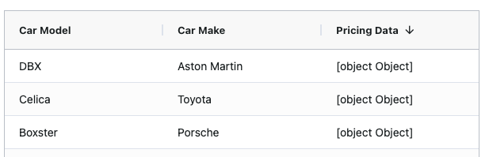
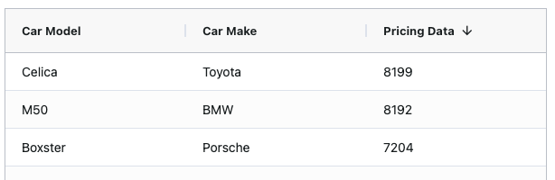
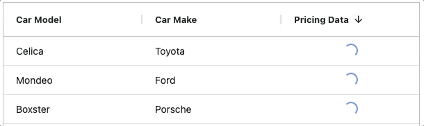

AG Grid does support observables as data input, but only one dimensional. If you have an observable that contains other observables
the values cannot be displayed.  
In this post I want to show you scenarios where this might be useful and how you can display those values properly with a loading
indicator.

- [Introduction](#introduction)
- [Example](#example)
- [Custom cell renderer](#custom-cell-renderer)
- [Loading overlay](#loading-overlay)
- [Sorting](#sorting)
- [Clipboard](#clipboard)
- [CSV export](#csv-export)
- [Excel export](#excel-export)
- [Pitfalls](#pitfalls)

## Introduction
Let me start of by saying, I'm aware that AG Grid is perfectly capable to handle (one dimensional) observables and for all the basic
examples out there you probably don't need the approach that is described here.  
This is useful if you fetch data from different endpoints and they vastly differ in either the purpose or the loading duration.  
One real life example where I used this a lot is if you fetch base data of business objects from one endpoint. Those are properties like
name and description. But from another endpoint you fetch some reporting information. The latter is drastically slower in performance and 
usually takes more than 5 seconds.  
The idea is to already display the information that is quickly available, while showing a loading indicator for the information that 
takes longer to fetch.

In this post I will take the very common AG Grid example with car information and simulate a loading for the car costs.

## Example
I'm going to reference this in the very beginning. Everything described in this post can be found in action in this 
[stackblitz](https://stackblitz.com/github/ngehlert/ag-grid-observables?file=src%2Fapp%2Fapp.component.ts) or this 
[GitHub repo](https://github.com/ngehlert/ag-grid-observables).  
But it probably still makes sense to check each chapter step by step to follow the thought process.

## Base setup
In my example I will use Angular as a framework. But the concept works equally well for others like react or vue.  
Our base column definition is going to look like this
```typescript
class AppComponent {
  public columnDefs: Array<ColDef<ITableEntry>> = [
    {colId: 'car.model', field: 'car.model'},
    {colId: 'car.make', field: 'car.make'},
    {colId: 'price', field: 'pricingData'},
  ];
}

interface ITableEntry {
  car: {
    model: string;
    make: string;
  },
  pricingData?: Observable<number>;
}
```

## Custom cell renderer
When we provide some data to our grid that follows the interface from above we will get the following result.

  
The result is actually expected, because AG Grid tries to display a string representation of the given object in the DOM 
and is not actually trying to resolve this observable.

We are going to create a custom cell renderer component that does this for us.

```typescript
@Component({
    selector: 'grid-text-renderer',
    template: '<span>{{value|async}}</span>',
    changeDetection: ChangeDetectionStrategy.OnPush,
})
class AgGridTextCellRendererComponent implements ICellRendererAngularComp {
    public value: Observable<string> = of('');
    private params!: ICellRendererParams;

    public agInit(params: ICellRendererParams): void {
        this.params = params;
        this.value = params.value;
    }

    public refresh(params: ICellRendererParams): boolean {
        this.agInit(params);

        return true;
    }
}
```
The interesting part here is the `public value` property to render the value in the template. The params assignment and the 
`refresh` implementation are just my defaults to be consistent and performant for all custom cell renderer components.  
The parameter `params: ICellRendererParams` will get the cell value as defined in our column definition by the `field` property.
You can also use a `valueGetter` to return an observable. However things like `valueFormatter` won't work. If you need a custom 
format you need to implement it in your cell renderer component. You can also use `cellRendererParams` on the column definition 
to pass additional properties or values to your component.

As a last step we need to define in our column definition to actually use this component 
```typescript
{
  colId: 'price', 
  field: 'pricingData', 
  cellRenderer: AgGridTextCellRendererComponent,
}
```

For more information on custom cell renderers check out the [AG Grid docs](https://www.ag-grid.com/angular-data-grid/component-cell-renderer/)

Now our result should look something like this
  
As you can see the observables are properly resolved and the real number value is being displayed.

## Loading overlay
We want to display a loading indicator to show to the user that the value for the cell is currently being loaded and he just needs 
to wait. There are different approaches how you can do this.  
You can extend the custom cell renderer we build in the previous step, and add a loading overlay that you trigger with `*ngIf` and 
hide it once the observable is resolved. But keep in mind, if you build multiple custom cell renderer for different observable purposes 
you need to implement this behavior in all of them.

Let me show you another AG Grid feature that is really awesome and pretty much made for cases like this.  
Im talking about `cellClassRules` on the column definition ([see docs](https://www.ag-grid.com/angular-data-grid/cell-styles/#cell-class-rules)).  
The base idea is that you can add/remove classes to each cell depending on the result of a function. For easier maintainability 
I've added this to the `defaultColDef` in my `gridOptions` so I don't have to redefine it for every column where I need this, but it is 
just automatically available. You can also add it to the regular column definition if you prefer.  
Now let's talk code
```typescript
import { first, forkJoin, isObservable, Observable } from 'rxjs';

public getDefaultColumnDefinition(_isServerSideRowModel: boolean = false): ColDef {
  const loadingStateByEntry: Map<unknown, boolean> = new Map<unknown, boolean>();
  const updateTableState: (params: CellClassParams) => void = (params: CellClassParams): void => {
    loadingStateByEntry.set(params.value, false);
    setTimeout(() => {
      params.api.refreshCells({
        suppressFlash: true,
        rowNodes: [params.node],
        columns: [params.column],
      });
    });
  };

  return {
    cellClassRules: {
      'grid-table-cell-loading': (params: CellClassParams): boolean => {
        const mapEntry: boolean | undefined = loadingStateByEntry.get(params.value);
        if (mapEntry !== undefined) {
          return mapEntry;
        }

        // Handle observables
        if (isObservable(params.value)) {
          loadingStateByEntry.set(params.value, true);
          params.value.pipe(first()).subscribe({
            next: (): void => updateTableState(params),
            error: (): void => updateTableState(params),
          });

          return true;
        }

        return false;
      },
    },
  };
}
```
We create a map `loadingStateByEntry` that represents the current loading state and whether an observable is already resolved 
or not. We use the reference of the observable as key and the loading state `true|false` as value. The benefit of using the 
reference here, is if multiple rows share the same observable reference it is only added once.  
The `updateTableState` function is used to update the table state and re-trigger the `cellClassRules` evaluation. Everything from the 
observable happens outside of any ngZone or grid change detection. The loading state is set to false in our map and with the grid api
we refresh our current cell.

The key `'grid-table-cell-loading'`in the `cellClassRules` object is a css class name that will be added to the cell itself 
whenever the function provided as value is returning true.  
First we need to check whether there is already an loading entry for our observable reference. Afterwards an `isObservable` check to ensure 
we only trigger the next code if it is really an observable.  
Now we can just subscribe to the observable - we are using the `first()` pipe to immediately unsubscribe and not create any memory leaks - 
and call our `updateTableState` function.

Last but not least we need to add a global style. In my case I'm just using a simple circle that spins around, but feel free to change it to a bar, 
hourglass or something more fancy.
```css
.grid-table-cell-loading::after {
  content: '';
  box-sizing: border-box;
  position: absolute;
  top: 50%;
  left: 50%;
  width: 20px;
  height: 20px;
  margin-top: -10px;
  margin-left: -10px;
  border-radius: 50%;
  border: 2px solid transparent;
  border-top-color: cornflowerblue;
  border-right-color: cornflowerblue;
  animation: spinner 1s linear infinite;
}
.grid-table-cell-loading::before {
  background: transparent;
  content: '';
  position: absolute;
  width: 100%;
  height: 100%;
  left: 0;
}

@keyframes spinner {
  to {transform: rotate(360deg);}
}
```

And now we should see a beatiful loading indicator while the observable is still loading and as soon as a value is resolved 
the loading indicator will disappear.
  
Tip: If you want to use a different spinner style or want to adjust the styles let the function for the cell class rule return 
true.

## Sorting
Feature wise we can stop after the previous chapter. The next couple of sections are just needed if you use the given feature.

The sorting of AG Grid is not going to work, because the grid has no idea how to sort objects by reference. But AG Grid - like always - 
has an awesome option to help us. We can use the `postSortRows` api for control over the sorted rows ([see docs](https://www.ag-grid.com/angular-data-grid/row-sorting/#post-sort))  
The base idea is to resolve all observables for the current sorted column and afterwards trigger the grid sort again to let is sort properly.

```typescript
postSortRows: (params: PostSortRowsParams): void => {
  if (skipNextPostSort) {
    skipNextPostSort = false;

    return;
  }
  const columnStates: Array<ColumnState> =
    params.columnApi.getColumnState();

  columnStates
    .filter((state: ColumnState) => !!state.sort)
    .forEach((state: ColumnState) => {
      const observables: Array<Observable<unknown>> = [];
      params.api.forEachNode((node: RowNode) => {
        const value: unknown = params.api.getValue(
          state.colId || '',
          node
        );
        if (isObservable(value)) {
          value.subscribe({
            next: (result: unknown) => {
              storeResolvedObservableValue(value, result);
            },
          });
          observables.push(value);
        }
      });
      if (observables.length) {
        forkJoin(observables).subscribe({
          next: () => {
            /**
             * If we re-sort after all observable data for a column sort is resolved we don't want
             * to execute postSort again (infinite loop)
             */
            skipNextPostSort = true;
            params.api.refreshClientSideRowModel('sort');
          },
        });
      }
    });
},
```
The core logic is in the `params.api.forEachNode`. We want to iterate each row and see if the current value is an observable.
If it is, we want to subscribe and store the given value with a little helper function I will explain in a second.  
With the `forkJoin` we want to wait for all observables to be resolved and then re-sort the grid again.  
To store the values I'm using a `WeakMap` (to prevent any memory issues) and store the value by observable reference.
```typescript
const valueByObservable: WeakMap<Observable<unknown>, unknown> = new WeakMap<Observable<unknown>, unknown>();
export function storeResolvedObservableValue(observable: Observable<unknown>, value: unknown,): void {
  valueByObservable.set(observable, value);
}
export function getStoredResolvedObservableValue(observable: Observable<unknown>): unknown {
  return valueByObservable.get(observable);
}
```

If we implement everything so far the result would still not work because AG Grid is still trying to sort by the reference.
So we actually need a way to tell AG Grid to use our resolved value instead of the reference.  
On the column definition there is a `comparator` property that allows us to specify a custom sort comparator function
([see docs](https://www.ag-grid.com/angular-data-grid/row-sorting/#custom-sorting)).

```typescript
export function getObservableNumberComparator(): (valueA: any, valueB: any, nodeA: RowNode, nodeB: RowNode, isInverted: boolean) => number {
  return (valueA: any, valueB: any, _nodeA: RowNode, _nodeB: RowNode) => {
    if (isObservable(valueA) || isObservable(valueB)) {
      return (getStoredResolvedObservableValue(valueA) as number || 0) - (getStoredResolvedObservableValue(valueB) as number || 0);
    }

    return valueA - valueB;
  };
}
```
The comparator function is very simple in this case. We just check if the provided values are actually observables and then fetch 
the result from our `WeakMap` from the previous step.  
If we update our column definition to include the `comparator` it looks like this and we can finally sort our price column
```typescript
{
  colId: 'price', 
  field: 'pricingData', 
  cellRenderer: AgGridTextCellRendererComponent,
  comparator: getObservableNumberComparator(),
}
```

## Clipboard
Same story as before. If you just try to use the clipboard copy out of the box you will get `[object Object]` copied 
into your clipboard. Like for everything else you can imagine there is a neat little property on the `gripdOptions` called `processCellForClipboard`
that allows us to hook into the process before the value is passed to the clipboard ([see docs](https://www.ag-grid.com/angular-data-grid/clipboard/#processing-individual-cells)).

A simple check whether the given value is actually an observable and then checking our `WeakMap` for the real value and returning this instead of the 
reference.
```typescript
processCellForClipboard: (params: ProcessCellForExportParams) => {
  if (isObservable(params.value)) {
    return getStoredResolvedObservableValue(params.value) || '';
  }

  return params.value;
},
```
Note: Keep in mind, this will only save your value to the clipboard if the value has already been resolved. If you try this during the loading, the 
result will just be an empty string.

## CSV export
Very similar as clipboard export. I'm just gonna link [the docs](https://www.ag-grid.com/angular-data-grid/csv-export/#reference-CsvExportParams-processCellCallback) 
and show the proper `gridOptions` property
```typescript
defaultCsvExportParams: {
  processCellCallback(params: ProcessCellForExportParams) {
    if (isObservable(params.value)) {
      return getStoredResolvedObservableValue(params.value) || '';
    }

    return params.value;
  }
},
```

## Excel export
Ok this is almost too easy… see [the docs](https://www.ag-grid.com/angular-data-grid/excel-export-customising-content/) and check out 
the `gridOptions` property
```typescript
defaultExcelExportParams: {
  processCellCallback(params: ProcessCellForExportParams) {
    if (isObservable(params.value)) {
      return getStoredResolvedObservableValue(params.value) || '';
    }

    return params.value;
  },
},
```
If this is only logic you have in your export functions and you actually use all three of them you can extract this logic into a separate 
function and use this to avoid copy paste
```typescript
function processCellCallback(params: ProcessCellForExportParams) {
  if (isObservable(params.value)) {
    return getStoredResolvedObservableValue(params.value) || '';
  }

  return params.value;
}
```
Then your `gridOptions` are more readable
```typescript
processCellForClipboard: processCellCallback,
defaultCsvExportParams: {
  processCellCallback: processCellCallback,
},
defaultExcelExportParams: {
  processCellCallback: processCellCallback,
},
```

## Pitfalls
In this section I just try to document issues I or others had in the past. If you have anything else to add, please let me know.

### DOM Virtualisation / observables are not triggered
If we build everything properly, the observables are only resolved if they are visible - only then a `.subscribe()` is being called.  
Be aware that all observables will be resolved upfront if you turn off row- or column virtualisation 
([see docs](https://www.ag-grid.com/angular-data-grid/dom-virtualisation/))  
And on the other hand don't be surprised if some observables are not triggered if they are currently not visible in the viewport

### HTTP requests are executed multiple times
If you are using HTTP requests for your observables you most like will notice that requests are now done multiple times. For most 
HTTP client implementations every separate `.subscribe()` call will actually do a separate request. We are now doing this for example 
the view in the template, the sorting and the export.  
You can use the `shareReplay` pipe ([see docs](https://www.ag-grid.com/angular-data-grid/dom-virtualisation/)) to prevent this and all 
`.subscribe()` calls will refer to the same HTTP request.  
Same concept applies if your original observable is very computation heavy. It's better to use the `shareReplay` pipe.

### Huge tables and sorting
If each cell uses a different observable and you have a grid with thousands of rows, be aware that if you sort for an observable 
column that **every** observable gets resolved. It might make sense to disable the sorting in such a case. 

### Row model type
This post was written for the client side row model. Other row models like server side, viewport or infinite
([see docs](https://www.ag-grid.com/angular-data-grid/row-models/#row-model-comparisons) might not work or need 
additional configuration effort.

### Streamed observables
This approach currently works best for observables that are completed after the first result. From my experience that was 
all the use cases I had. Theoretically this is also possible for observables that emmit multiple values, however you probably 
need to adjust couple of things. Find a better `unsubscribe` logic in the sort function to replace the `first()`.  
Alternatively you can also just create a new observable and re-assign it to the field in your grid data. The big advantage 
is that you get the loading indicator displayed again if you start a new request/loading time. 