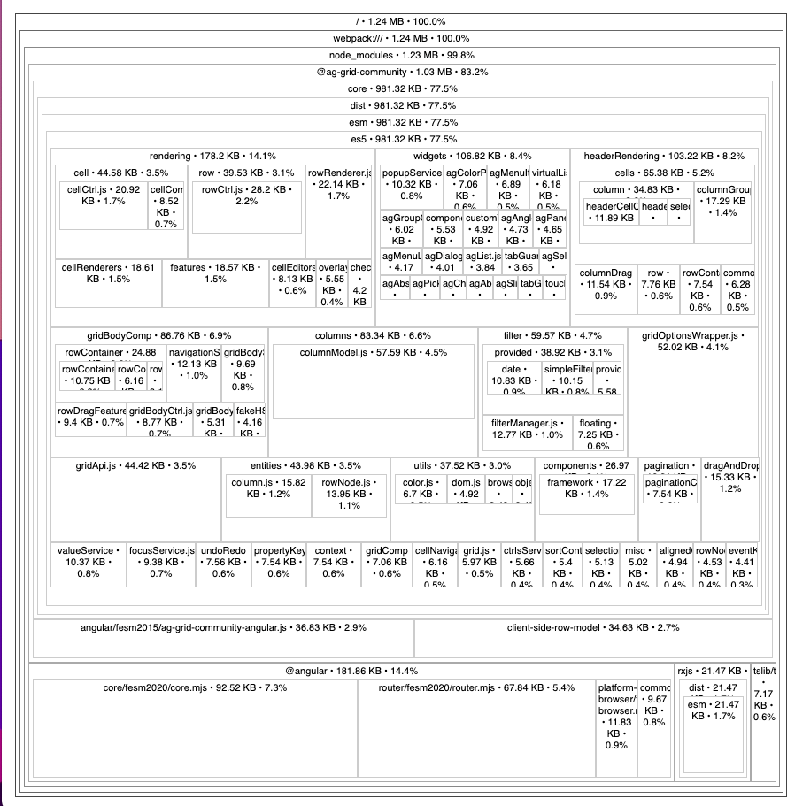
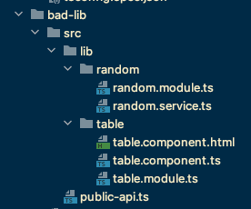
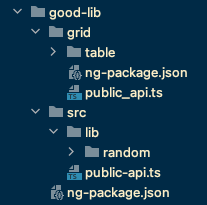
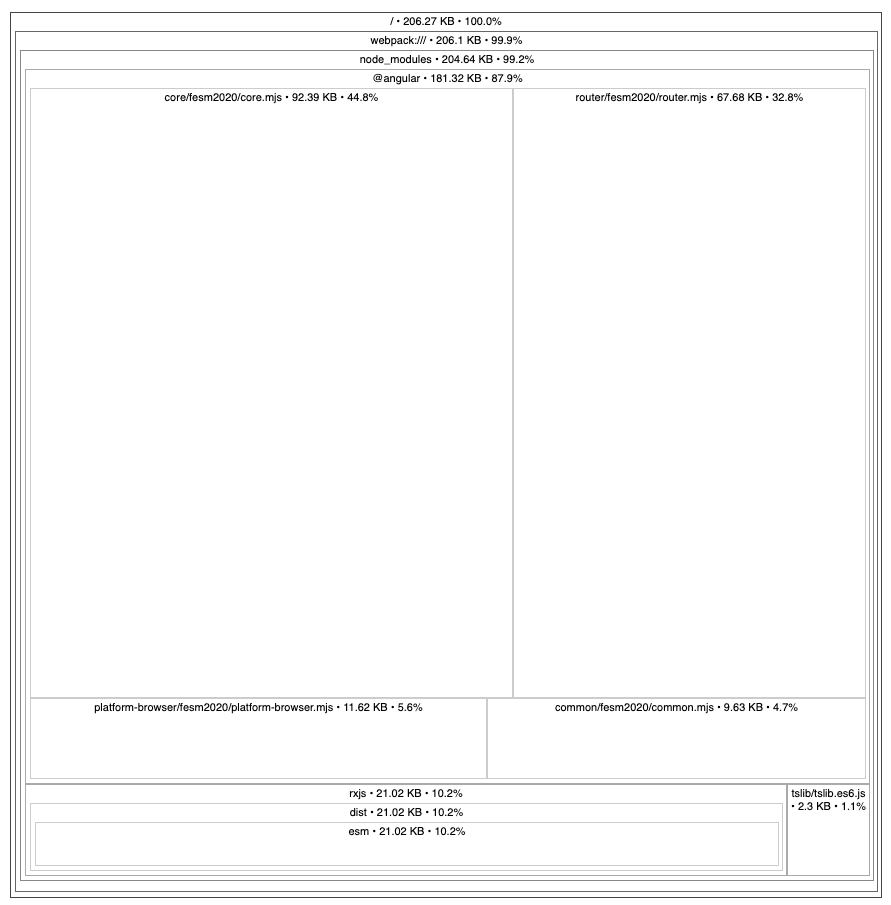

Using an Angular workspace with your own library you might've noticed that your main bundle size keeps increasing the more features you are adding - even if you 
are not using all features up front. Let me show you how you can build a sustainable and lightweight library structure for your own library.

- [Introduction](#introduction)
- [Bundle analyzer](#bundle-analyzer)
- [Problem analysis](#problem-analysis)
- [Solution](#solution---multiple-entry-points)
- [Test for yourself](#test-for-yourself)

## Introduction
Angular libraries are awesome and Angular does a good job giving you a kick start with their [documentation](https://angular.io/guide/creating-libraries). 
However this only works for very simple and small libraries. If your library gets bigger and you want to optimize it, I found 
there to be very few good resources.  

Let me tell you an example. I'm using a big library with dependencies like AG Grid to provide shared components and services 
in a multi application Angular workspace. I'm using lazy loading for all my routes but I discovered the main bundle get's increased 
for all applications if I add more things to the library. At some point I was just using a simple data service in the main 
application and an AG Grid component few lazy loaded modules down the line, but still AG Grid and all components were added to the 
main bundle.  
In this post I will show you how to analyze your package and how to properly set up your library in order to prevent similar issues.

All examples in this post use a sample project at [https://github.com/ngehlert/angular-lazy-load](https://github.com/ngehlert/angular-lazy-load).

## Bundle analyzer
A bundle analyzer allows you to get insights in your bundled JavaScript. It shows you what dependencies are included and how much space 
each section needs.  
The Angular team recommends to use a tool called `source-map-explorer`. A lot of other post show tools like `webpack-bundle-analyzer`
or others. To some extend they work as well, but let's stick with the `source-map-explorer` for now. 

First we need to install it with npm or yarn
```bash
npm install -g source-map-explorer
yarn global add source-map-explorer
```

Now build your project with the `--source-map=true` flag. (If you are using a project with an Angular version prior 12 also add the `--prod` flag) 
```bash
ng build app --source-map=true
```
And now we can have a look at our stats with 
```bash
source-map-explorer dist/app/main.js
```
The result looks something like this . 

## Problem analysis
Let's have a look at our sample application. We are using a small service and a component to display a simple table .

In our `app.component.ts` we are using the `RandomService` and in our lazy loaded route the `TableComponent`.  
But if we have a look at our bundle analysis (see screenshot above) we will notice that AG Grid is actually added to the main module, instead of the lazy loaded one.

It turns out by default an Angular library is actually not tree shakeable, and you will always add the entire library to your bundle, even if you are just 
importing one service or variable. 

## Solution - Multiple Entry points
You can create multiple entry points to your library and then you only need to import a specific entry point you are interested in, instead of the entire library. 
Angular material is using the same concept, for example `import {MatDialog} from '@angular/material/dialog';`  
Creating separate entry points is actually fairly simple and you only need to create a new directory inside your library and add an `ng-package.json` file. 
Inside the `ng-package.json` you need to put the following content
```json
{
    "$schema": "../../../../node_modules/ng-packagr/ng-package.schema.json",
    "lib": {
        "entryFile": "public_api.ts"
    }
}
```
In our example I moved the `table` directory into a separate `grid` directory next to the already existing `src` directory. .

If you now run `ng build good-lib` you will notice that actually two entry points are created
```
Building Angular Package

------------------------------------------------------------------------------
Building entry point 'good-lib'
------------------------------------------------------------------------------
✔ Compiling with Angular sources in Ivy partial compilation mode.
✔ Writing FESM bundles
✔ Copying assets
✔ Writing package manifest
✔ Built good-lib

------------------------------------------------------------------------------
Building entry point 'good-lib/grid'
------------------------------------------------------------------------------
✔ Compiling with Angular sources in Ivy partial compilation mode.
✔ Writing FESM bundles
```
Now just one step is missing in order to use the secondary entry points. Go to your `tsconfig.json` (in your root directory). And extend the path entry for your library with a 
placeholder match.  
before:
```json
"paths": {
  "good-lib": [
    "dist/good-lib"
  ],
},
```
after:
```json
"paths": {
  "good-lib/*": [
    "dist/good-lib/*"
  ],
  "good-lib": [
    "dist/good-lib"
  ],
},
```
Note: You just need to do this once for your first secondary entry point. All future entry points will be resolved as well.

You can now use the `TableModule` from the secondary entry point like this `import { TableModule } from 'good-lib/grid'`;

## How to reference between the different entry points
You can NOT use relative imports between difference entry points. You need to import from the build package like you would from a regular application 
as well. In our example this would be `import {RandomService} from 'good-lib';` if you want to use it in the grid entry point.

Note: `ng-packagr` will detect in which order it needs to compile the different entry points so everything can be resolved. You will get an 
error if you introduce a circular dependency and two (or more) entry points actually try to import from each other.

## Test for yourself
You can clone the [https://github.com/ngehlert/angular-lazy-load](https://github.com/ngehlert/angular-lazy-load) and just need to change three imports
to switch between the good and the bad library. [See what imports to change](https://github.com/ngehlert/angular-lazy-load/commit/90995878740d9df7139beebb43bee0cd54967136) 

In the end with the good library AG Grid gets added to the lazy loaded route instead of the initial bundle.
 And our initial bundle is only 200kb instead of 1.3mb