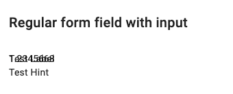
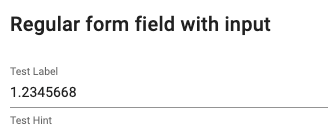

With Angular version 15 many of the Angular material components have been refactored to use the Material Design Components 
for web (MDC). This change itself is awesome for all Angular folks because now the accessibility drastically improved and 
the components are closer to the official material specs.  
However this also means that you need adapt and check your entire application because for some components even the API changed.
To reduce the pain of upgrade (everything at once) Angular is providing the previous material components under a separate 
legacy import, e.g. `import {MatSelectModule} from '@angular/material/select';` becomes 
`import {MatLegacySelectModule as MatSelectModule} from '@angular/material/legacy-select';` (important: you really should use 
`ng update` then the cli will convert all imports automatically).

In my case I wanted to use the legacy components in all places to get the Angular upgrade done and tackle the new style components 
afterwards. After I upgraded everything with `ng update` nearly everything was broken and looked wrong.



I discovered that the way how you define a theme is now different for Angular Material 15 ([See docs](https://material.angular.io/guide/theming)).
```scss
@use '@angular/material' as mat;

@include mat.core();

$my-primary: mat.define-palette(mat.$indigo-palette, 500);
$my-accent: mat.define-palette(mat.$pink-palette, A200, A100, A400);

$my-theme: mat.define-light-theme((
 color: (
   primary: $my-primary,
   accent: $my-accent,
 ),
 typography: mat.define-typography-config(),
 density: 0,
));

@include mat.all-component-themes($my-theme);
```
But even with those changes the legacy components still look off.

## Solution

We need to include another scss mixin for the core and legacy styles. 
```scss
@use '@angular/material' as mat;

@include mat.core();
@include mat.legacy-core();
...
...
@include mat.all-component-themes($my-theme);
@include mat.all-legacy-component-themes($my-theme);

```

If you do not include the all-component-mixin you can also include individual legacy themes. They are always prefixed with `legacy-`
```scss
@include mat.button-theme($my-theme);
@include mat.legacy-button-theme($my-theme);
```

And now our styles look *just*  like before
