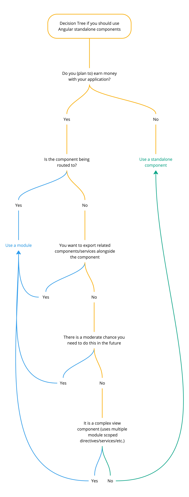

With Angular 15 Angular introduces the stable version of standalone components. I'm not going into very deep how they work.
If you are unfamiliar with the topic check out [their guide](https://angular.io/guide/standalone-components) how to get started.

Disclaimer: These are just my personal preferences. I try to give reasons for each one of the mentioned points. If you disagree 
with something that is being said that's totally ok ;)

Personally I think standalone components won't/should replace proper modules. I think there is room for both things to exist - 
even in the same application.

### Do you (plan to) earn money with your application?
If you do not earn money with your application and are just building a side project I think you can always use standalone 
components. It's easier to get started, less overhead and those projects usually stay within a manageable size.  
If you want to practice a *proper* (scalable) architecture you obviously still can use modules.

### Is the component being routed to?
Just to clarify again, if you reach this point in the decision tree we are talking about enterprise applications. Sometimes overhead 
is knowingly accepted if benefits like maintainability and scalability outweigh the cost.

While routing to (and lazy loading of) standalone components is technically possible ([See Angular docs](https://angular.io/guide/standalone-components#routing-and-lazy-loading)) 
I mostly don't like it. I use page modules as the very core of the application structure. And in my experience having modules 
with separate directories and module structure just gives an additional kick in terms of scalability and maintainability.  
And page components tend to contain a lot of application logic, import multiple other modules, services, etc. 
(more on those points in the next steps)

### You want to provide related components/services alongside the component
Standalone components should really follow the single responsibility principle.   
If you want to provide additional things like 
* Other (child) components
* Directives
* Styles
* Services 
you should wrap them inside a module. The component itself will become very cluttered and confusing.

### There is a moderate chance you need to do this in the future
Basically same point as before. Even if your component is currently just providing itself, if there is a moderate chance that 
this might change in the future and you can already imagine some use cases that *might* happen I would just use a proper 
module from the beginning. This saves time if you need to have a module along the road and does not really harm if you end up 
not needing it.

### It is a complex view component (uses multiple module scoped directives/services/etc.)
Final nail in the coffin…  
The goal should be to keep components as small and as independent as possible from application logic and other components. 
For simple components I would always prefer a standalone components in contrast to a module. It just saves some overhead 
that is not really needed.  
But this also means you can use the amount of standalone components as a *measurement* how well you structure and build 
your application. If I use a lot of standalone components this generally means I use a lot of small and independent components.  
If I use modules everywhere that import a lot of things and create a lot of dependencies than there is definitely room for 
improvement.

## Feedback
Standalone components are very new and exciting. I'm looking forward to how it all unfolds in the next couple of Angular versions. 
If you are already using standalone components in your application(s) let me know how you decide when to use what. 
Where do you see the biggest benefit of standalone components? Do you think Angular will eventually get rid of modules completely?