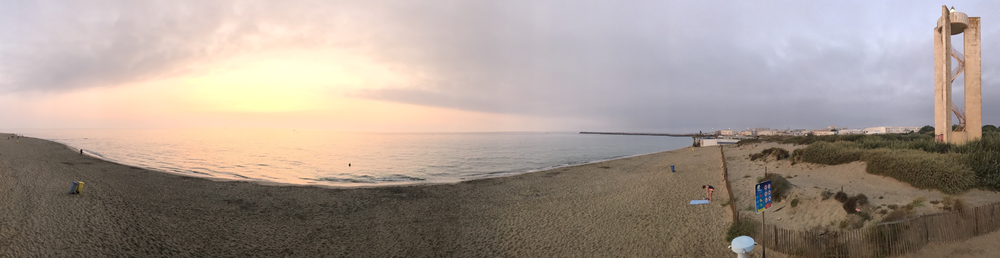

Currently I'm on vacation in South France with my wife and our two kids. I knew I would not make it two weeks without 
thinking about coding, so I tried to find a way how to enjoy and fully relax at the beach without wasting any precious 
vacation time in front of my MacBook.

- [Block work](#block-work)
- [Beach driven development](#beach-driven-development)
- [tl;dr](#tldr)

## Block work
First things first. I completely blocked every work notifications. I think this is the first time ever I actually 
didn't check my work e-mails or messages during vacation - not even once.  
For most people and vacation guidelines this seems like common sense, and it probably is. However, I couldn't help just 
logging in from time to time just to stay somewhat up to date.

But oh boy, is this a difference like night and day. Not having to think about work at all truly helps with enjoying the 
sun and the sea.

## Beach driven development
Now that work is off the plate I have to prepare my mind with other sources of "development-time" from my private projects.   
First I prepared a couple of "things to think about" before actually leaving for vacation. Those are mostly problems where I 
faced a wall in the past and I'm not quite sure how to continue in the future or architectural things like how to properly 
log and store my errors. But even basic stuff like what new features could be useful or which existing feature could be 
improved.  
I keep this list in the back of my head and let my subconsciousness do the work while I'm reading a book or build a sand 
castle with my daughter. It is very important to me that I don't *"actively"* think about those problems since I fully want 
to enjoy family time. But the human subconsciousness can work wonders - from time to time just complete plans and answers 
will pop into my mind and I just have to take notes.  
And the second part relates to the time when my mind *"actively"* tries to think about coding, e.g. while taking a nap at the 
beach. In those cases I try to focus my mind on basic stuff like how can an user interface look like (sand drawings are 
actually quite helpful for this one 😄). And another possibility is planning ahead. I'm not actually thinking about 
the problem in my head right now but rather asking myself: "How can this be postponed?" (e.g. how can this be divided into smaller 
problems, what pre-steps could be taken, etc.) and let the *future me* take care of the rest.

## tl;dr
To sum it up, I'm really enjoying my family time with the nice weather down here in South France. I try to think as little as 
humanly possible about coding. For the times where I fail at this task I have a two step safety net
* Let my subconsciousness do the work (as long as it is busy thinking about code the consciousness has fewer reasons 
to intervene)
* Postpone problems. Break into smaller problems. Let the future me handle those things (maybe it works  out because of step 1)

Let me know how you manage to enjoy your vacations, if you have any tricks how to keep your mind busy without sacrificing 
any of the relaxation.
