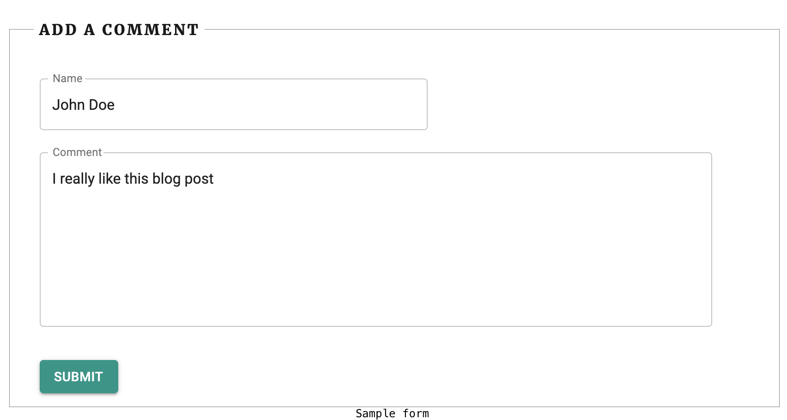

This is a little tutorial on how to add comment functionality to your existing [Gatsby](https://www.gatsbyjs.org/) blog. This should be a beginner tutorial, so even if you are pretty new to [Gatbsy](https://www.gatsbyjs.org/) you still should be able to get this running.  
Your blog should be hosted on [Netlify](https://www.netlify.com) so we can make use of their [forms](https://www.netlify.com/products/forms/) functionality.  
The comments will be **truly static** and saved in your repository - no additional data base or 3rd party is required.

- [The form](#the-form)
- [Get form submissions in your project](#get-form-submissions-in-your-project)
- [Display comments](#display-comments)
- [Conclusion](#conclusion)
- [References](#references)



## The form
[Netlify forms](https://www.netlify.com/products/forms/) allow us to setup and more importantly collect data from forms without the need of any backend code or infrastructure.

Firt we need to add a `netlify` attribute to our form element. [Netlify](https://www.netlify.com) will look for this attribute and automatically sets everything up.
```html
<form
  name="comment-form"
  method="post"
  data-netlify="true"
>
    <input type="hidden" name="form-name" value="comment-form" />
    <input type="hidden" name="slug" value={this.props.pageContext.slug} />
    // Add name input
    // Add comment input
    // I also added a checkbox for gdpr consent
    // Can be omitted, but you may need to adapt other things later
    // Workaround:  just add a hidden input that is always true ;)
</form>
```
The two hidden `input` fields are important. The first one is needed for the [Netlify](https://www.netlify.com) bots to properly recognize the form name (should be the same name as on the name attribute on the form).
And the second should be a unique identifier to the respective site and is important so you can match the comments later to the correct blog page. In my case I use the URL slug.

Now it's time for a test submission. If you set up everything correctly you can navigate to the forms tab in your [Netlify](https://www.netlify.com) project and should be able to see your current submission.  
If you want to have a different success message you can provide the path in the `action` attribute of the `form` ([Docs](https://docs.netlify.com/forms/setup/#success-messages)) 

## Get form submissions in your project
Now we need to get the form submissions from [Netlify](https://www.netlify.com) into our repository. For this I created a simple script - [comment-approval.js](https://github.com/ngehlert/developapa/blob/master/comment-approval.js). Put this script in the top level of your project. (By default your comments will be put in the `content/comments` directory. If you want to change that, change the `commentPath` variable in the top)  
You need a couple of dependencies for this script to run. Install them with:
```
npm install -D clear dotenv handlebars netlify prompt
``` 
Create a `.env` file next to the script file and add the following content
```
NETLIFY_TOKEN=YOUR_TOKEN
NETLIFY_SITE_ID=YOUR_SITE_ID
```
Replace `YOUR_SITE_ID` with your site id. Go to [Netlify](https://www.netlify.com) --> Your project --> Site settings and in the Site information card you should see your API ID.  
Replace `YOUR_TOKEN` with an access token for the [Netlify-API](https://docs.netlify.com/api/get-started/#make-a-request). Click your profile picture on the top right on the [Netlify](https://www.netlify.com) page and go to User settings. Go to the Applications menu and create a new access token.

Important: Make sure your `.env` file is in your `.gitignore` to prevent it from being commited into your repository

Create a `comment-template.md` file with the following content next to the other two files
```
---
name: "{{name}}"
slug: "{{slug}}"
date: "{{date}}"
---
{{comment}}
```

Now everything is setup and we should be able to run the script with `node comment-approval.js`. You will be guided through each submission and can decide to ignore it, approve it (a file in your repository will be created) or remove it (will be removed from the [Netlify](https://www.netlify.com) server). Now approve your test submission from step one

## Display comments
Quick recap, we are able to submit comments and download them from [Netlify](https://www.netlify.com) and put them in our project. Now we just need to display them in our blog post page.  
Open your `gatsby-config.js` and look for a usage of `gatsby-source-filesystem`. This tells [Gatsby](https://www.gatsbyjs.org/) where to look for your blog articles. It probably looks something like this
```javascript
{
  resolve: `gatsby-source-filesystem`,
  options: {
    path: `${__dirname}/content/blog`,
    name: `blog`,
  },
},
```
The name is actually quite important and we will need this later. Now add a configuration block for the comments, for example
```javascript
{
  resolve: 'gatsby-source-filesystem',
  options: {
    path: `${__dirname}/content/comments`,
    name: 'comments',
  },
},
```
Now open your `gatsby-node.js` and look for a `onCreateNode` and add the parts that are missing of the following snippet
```javascript
exports.onCreateNode = ({ node, actions, getNode }) => {
  const { createNodeField } = actions;

  if (node.internal.type === `MarkdownRemark`) {
    const slug = createFilePath({ node, getNode });
    const collection = getNode(node.parent).sourceInstanceName;
    createNodeField({
      name: `slug`,
      node,
      value: slug,
    });
    createNodeField({
      name: `collection`,
      node,
      value: collection,
    });
  }
};
```
You probably already have something like the *slug* part in place, then just add the second paragraph. We now add the previous specified name, **blog** and **comments**, to each node so later we can query this specific field with [GraphQL](https://graphql.org/). Now open your file were you want to show your comments, in my case this is the `post-entry.js`. Update the [GraphQL](https://graphql.org/) page query and add
```javascript
comments: allMarkdownRemark(
  filter: {
    fields: { collection: { eq: "comments" } }
    frontmatter: { slug: { eq: $slug } }
  }
) {
  edges {
    node {
      id
      html
      frontmatter {
        date(formatString: "MMMM DD, YYYY")
        name
      }
    }
  }
}
```
Let me quickly explains what happens here. The first part `comments` is our parameter to get the data later (and prevents collisions if you already use the identifier `allMarkdownRemark`).  
* With the `fields` filter for the collection we can now specify were to look for our comments
* The second row filters for our page identifier
* And the rest are just the fields we want to display

 We are almost done. Now access your comments in your `render` method and  `Array.map()` through them to add all comments to your template. You can also specify a message if there are no comments available.
 ```javascript
render() {
  const comments = this.props.data.comments.edges;
  return (
    <div>
      {comments.map(({ node }) => {
        return <div>
          <p>Define how your comment should look like</p>
          <p>Name: ${node.frontmatter.name}</p>
          <p>Date: ${node.frontmatter.date}</p>
          <div dangerouslySetInnerHTML={{ __html: node.html }}/>
          </div>;
      })}
      {comments.length === 0 ? (
        <div>
          There are no comments available for this blog post yet
        </div>
      ) : null}
  )
}
```

## Conclusion
I hope you could follow along and now have a beautiful blog with awesome comments.  
I know there are billions other approaches out there to get comments into your project, I even tested 2 different approaches before coming up with my own version.  
What I like about this way is having everything in my repository. I had a previous version that automatically created Pull requests in GitHub ([Example](https://github.com/ngehlert/developapa/pull/19)), but I don't like this version anymore, since PRs can't be deleted - just closed.  
Every form submit will theoretically be visible forever and I can't do anything about it. There are plenty of cases were this might be bad, e.g. submissions that accidentally contain sensitive data, rude/sexual spam, etc.

Let me know if you managed to get your comments running or on what steps you stumbled. I'm happy to rework any part of this tutorial and explain it more in depth. 

## References
I tried to provide the example really basic, so it is easier for you to implement in your own project. However if you want to see some real life examples you can check out the links below that point to this blog here

* [My comment form](https://github.com/ngehlert/developapa/blob/master/src/templates/comment-form.js)
* [Post Entry](https://github.com/ngehlert/developapa/blob/master/src/templates/post-entry.js)
* [Comment Card](https://github.com/ngehlert/developapa/blob/master/src/templates/comment-card.js)
