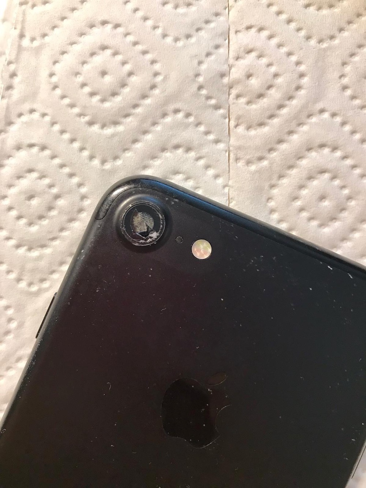
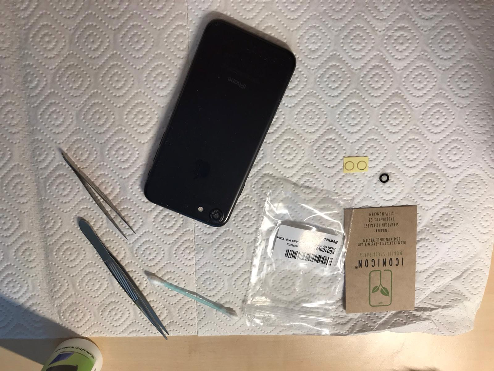
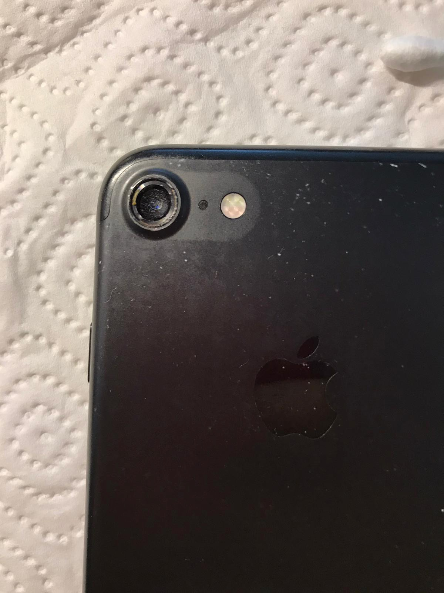
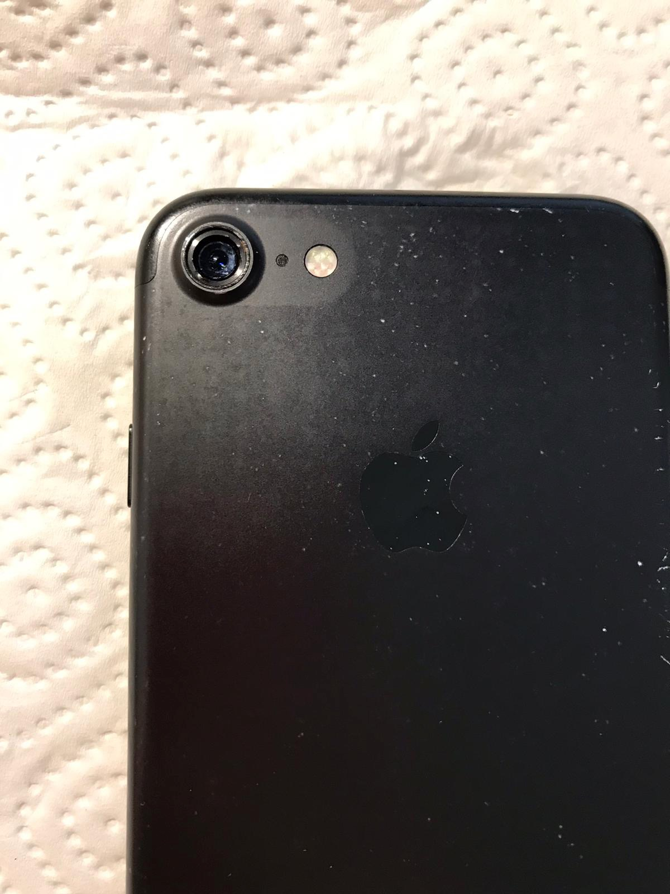
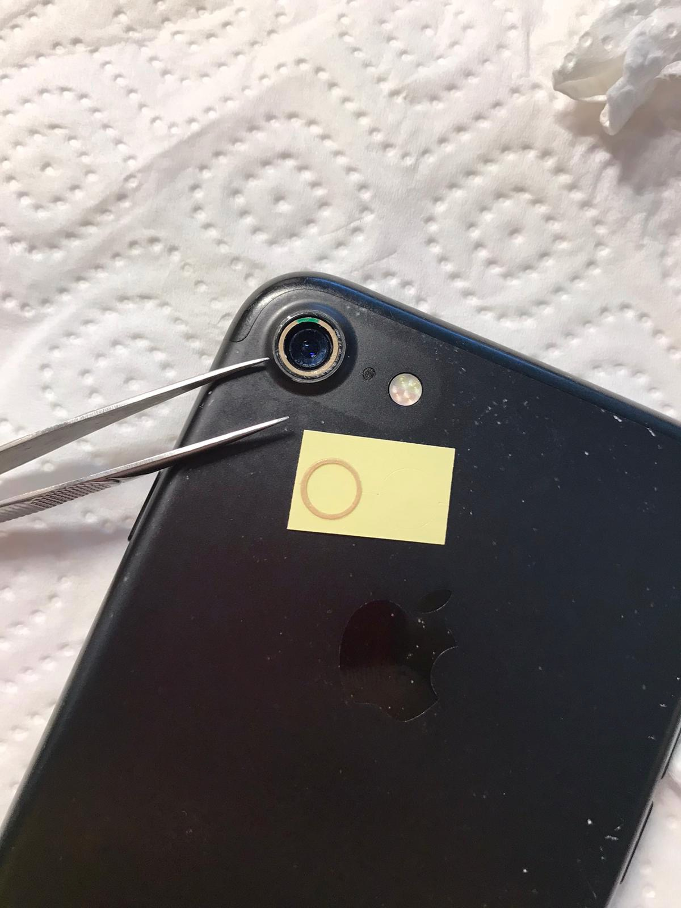
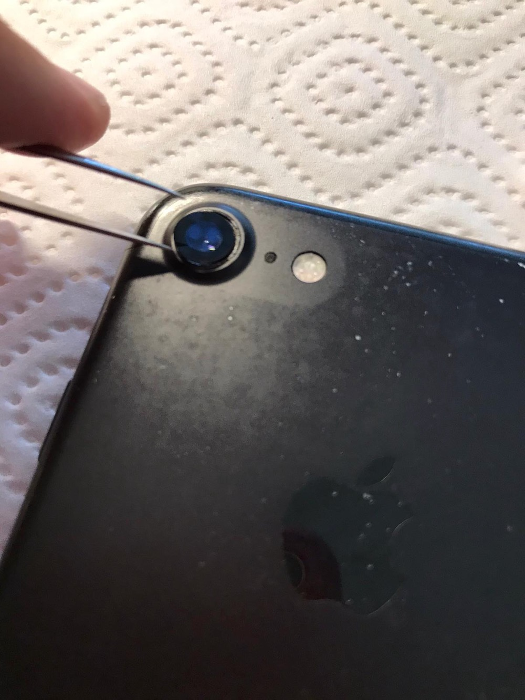
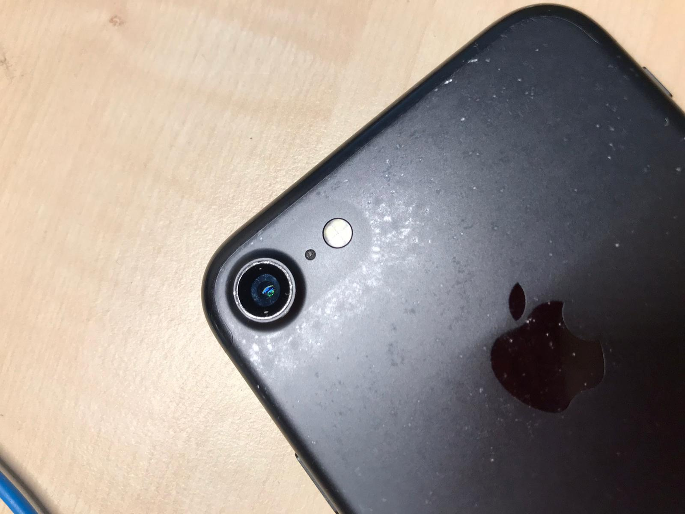

A picture says more than a thousand words.

As you can see if the camera glass has a small crack there will eventually be dust on top of the lens and really reduce 
the image quality.  
This is just a quick tutorial on how to fix a broken camera glass on an iPhone 7 (works for 
8 and SE 2nd Edition as well - probably applicable for other series).  
I was pleasantly surprised to discover that the total repair was actually pretty simple and took only 5-10 minutes.

## Full set of tools

* [Set with glue and new camera glass ](https://smile.amazon.de/gp/product/B07H6ZVL83/)
* Pair of small tweezers
* Cotton swab
* Water / display cleaner
* Broken iPhone

## Step 1

Completely remove the broken glass with a pair of small tweezers. This requires some force due to the glue but be careful 
to not damage the lens itself. 

## Step 2

Clean the lens with some small tissue / cotton swab (and water / display cleaner - depends on the amount of dust). 
Again be really careful and don't apply too much pressure otherwise you 
might damage the autofocus. If completed take a picture and check if there are any dust spots left.

## Step 3

Place the new glue ring (double-sided tape) on top of the border around the lens and make sure it does not overlap. 
Then press glue firmly and remove upper side from the tape.

## Step 4

Place the new camera glass on top of the tape. Be careful to not touch the glass with your fingers since may cause visible 
finger/fat prints. Again apply some pressure to strengthen the glue.

## Complete

And voilà everything complete

