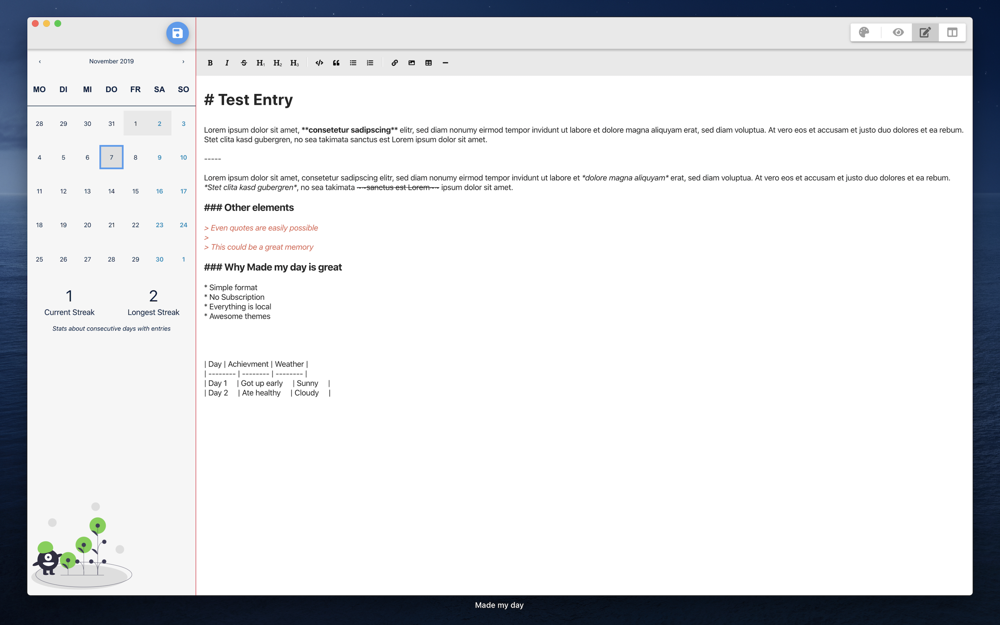
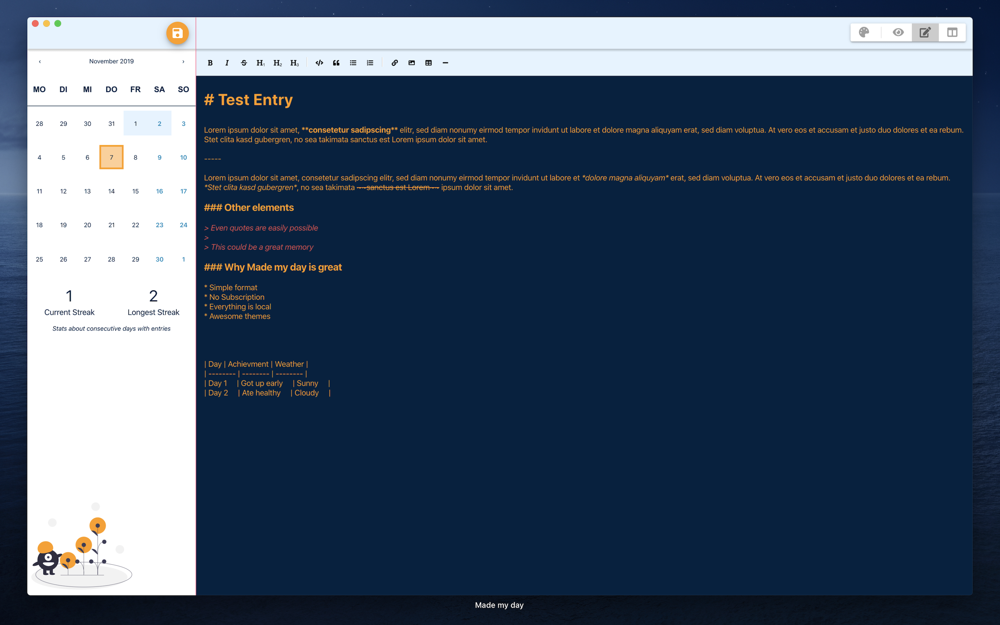
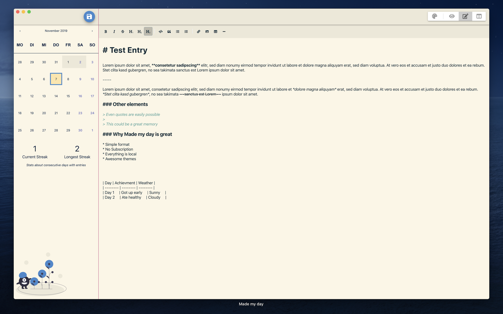
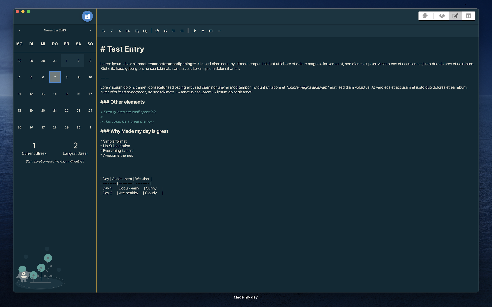

#### Click [here](https://apps.apple.com/us/app/made-my-day/id1481700999?l=de&ls=1&mt=12) to get it from the App Store
If you don't know *Made my day* yet, head over to [my first Blog Post](/made-my-day) for more information.  
I want to quickly introduce the new update

- [Themes](#themes)
- [Stability improvements](#stability-improvements)
- [Conclusion](#conclusion)

## Themes
Everybody loves themes! I improved the business logic so I can add new themes now pretty easily. If your favorite theme 
is not available yet, just leave a comment and I try to add it in a future update.  
**Every theme will always be available for free!**

Let me show you the current themes

### Default

I changed the default from a dark theme to a light theme because more people are actually familiar with light themes.

### Cobalt 2

This one was the previous default theme and is my personal favorite. I use this also in my IDE for developing or Mattermost. 
If you are interested, you can find more information on [my github repository] (https://github.com/ngehlert/cobalt2)

### Solarized Light

This one is a pretty popular one. ([https://ethanschoonover.com/solarized](https://ethanschoonover.com/solarized/))

### Solarized Dark

Same as the previous one - but dark!

## Stability improvements
I added couple of checks to automatically save your journal entry, for example on (accidental) app close, so your entries are 
always safe!  
I also made some internal improvements that should increase the overall performance, especially on older Macs.

## Conclusion
I just want to say thank you for all the great feedback, support and suggestions I have received - it does mean a lot to me.  
There probably will be another update in the next 2-3 weeks. Leave a comment if there is any feature or theme you are missing.