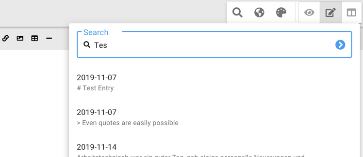

#### Click [here](https://apps.apple.com/us/app/made-my-day/id1481700999?l=de&ls=1&mt=12) to get it from the App Store
If you don't know *Made my day* yet, head over to [my first Blog Post](/made-my-day) for more information.  

It is finally happening. There's a new update for [Made my day](https://developapa.com/made-my-day) available.
Read below for more details.

- [Search](#search)
- [Library Updates](#library-updates)
- [Bugfixes](#bugfixes)
- [Future plans](#future-plans)
- [Conclusion](#conclusion)

## Search
Let's start of with a new feature. In the top right corner there's a magnifying glass icon that opens 
a search. This function allows you to quickly find any entry you've made - even if it was a long time 
ago.  

## Library updates
This part is usually not very interesting for non-devs, feel free to skip if you are not interested ;)
The biggest upgrade was probably from `electron: 6` to `electron: 16`. Quite some stuff broke and has changed in the 
meantime. It took me a while to figure out how to properly communicate from the main window to the rendered window 
and share information between them. All changes electron made were based on security decisions, which means in the end 
I'm a big fan.
The other libraries with bigger version jumps were `react`, `@material-ui` and `date-fns`.

I definitely need to stay more up to date with those libraries. Some of them were actually very annoying to update.

## Bugfixes
* Fixed a smaller bug that you were not able to open links in your entries

## Future plans

* Search for dates - Just while writing this article I discovered that this is not possible
* Export function. This seem to be one of the most requested features. Still looking for input and feedack here. 
  In what kind of formats would you be interested? PDF? HTML?

## Conclusion
This time it took me very long for two reasons. While the library update was very painful for some parts but the even 
more painful part was figuring out the signing process for the Apple Mac App Store again. Because `electron` changed, 
the packaged version is different so the entire signing process did not work anymore. 
Maybe it's just me, but I always struggle with the signing when something is not working out of the box. Never seem to 
find the right ressources…  
On the bright side, everything is working currently and I'm already working on the next update.

If you have any suggestions or feedback, feel free to leave a comment below.

I'm trying to use another channel to communicate and receive feedback, feel free to reach me over at twitter at 
[@ngDevelopapa](https://twitter.com/ngDevelopapa). It's easier for me to share regular updates and answer direct questions.

