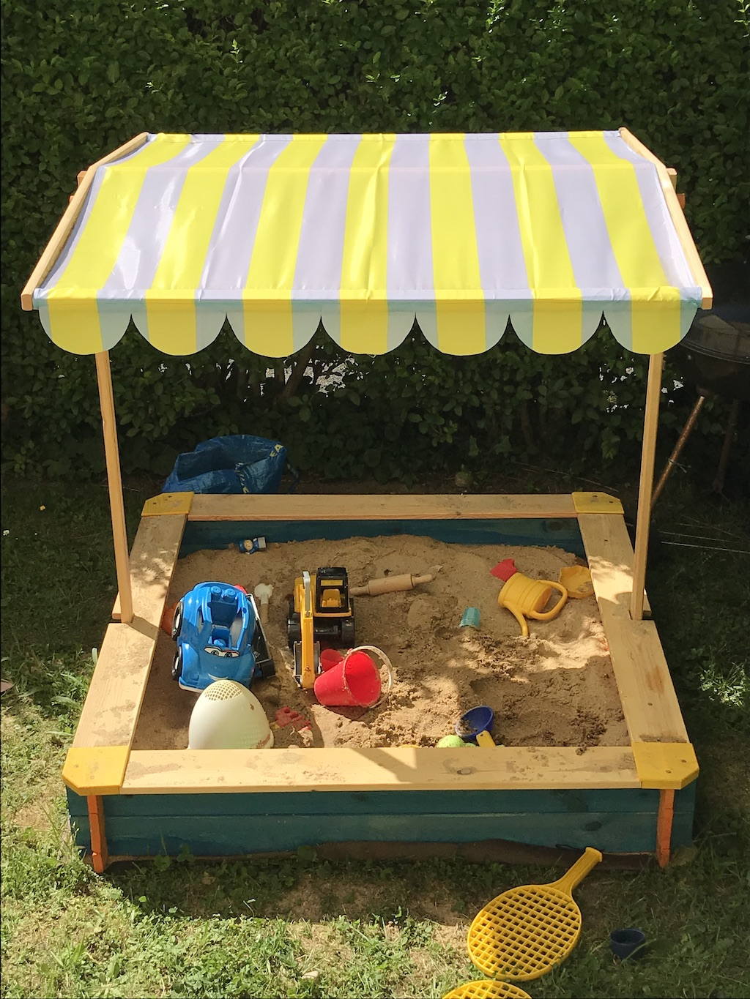

Everybody is talking about Corona / Covid-19 so I might as well join
- [Homeoffice](#homeoffice)
- [Side projects](#side-projects)
- [Squirrel Proof Bird Feeder](#squirrel-proof-bird-feeder)

## Homeoffice
Since the pandemic spreaded in Germany I've been working exclusively remote from home. It took some time in the beginning 
to adjust, especially since the kindergarten is closed and both kids are at home the entire time. Even playgrounds were 
closed, so I channeled my inner craftsman and build a sandbox for the kids.

I also bought a small slide and some other stuff for the kids to play outside.  
Our garden is not really big and borders to the street on two sites, however I really learned to appreaciate even the tiniest 
bit of green and playing ground for the kids. As long as the weather allows it, the kids can play outside for a couple of 
hours every day.  
Sometimes I even grab my MacBook and a camping-chair and do some coding outside.

## Side projects
Since I'm currently already coding 8 hours at home for my work, I'm currently not really motivated to work on my private projects and 
just wanted to relax in the evenings.  
I had contact with a couple users of [Made my day](https://developapa.com/made-my-day) regarding feedback and 
feature ideas. I'm still not sure what to implement and what might be useful. If you have any ideas just drop a comment below.

Besides that I'm looking for a new "thing" to start. Maybe I try out another new technology / framework / library, 
do some client work or maybe another mobile game… Feel free to send me some ideas.

## Squirrel Proof Bird Feeder
This one is going to be a quick sick video and youtube channel recommendation.  
The video I'm talking about is this one: [https://www.youtube.com/watch?v=hFZFjoX2cGg](https://www.youtube.com/watch?v=hFZFjoX2cGg)

Mark Rober is a former NASA engineer and currently does entertaining content for science stuff, carnival scams, 
squirrel proof bird feeders, porch pirates, water melon tricks, nerf guns and much more.

He is really entertaining and often times somewhat educational as well.
