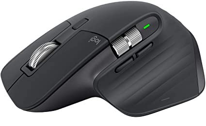
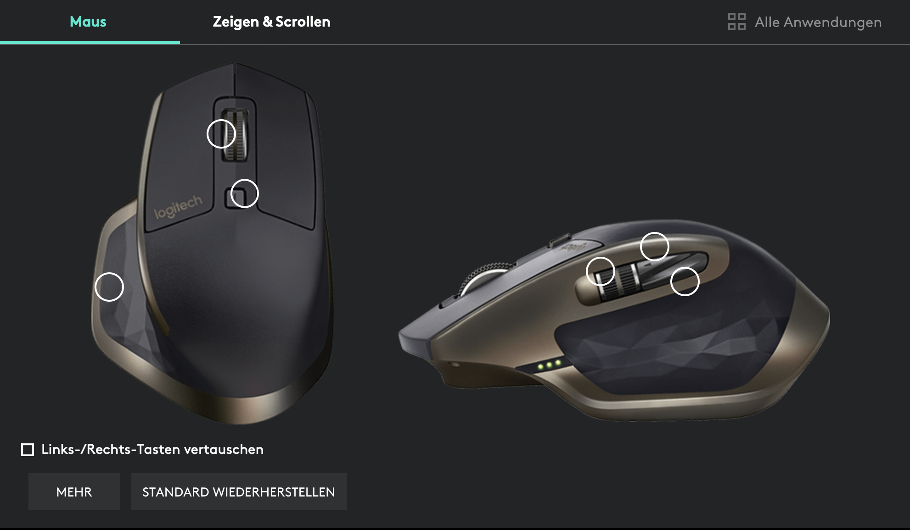
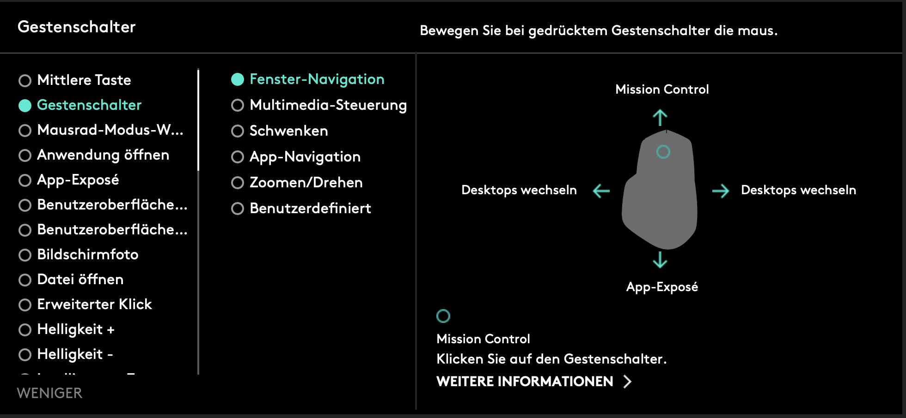
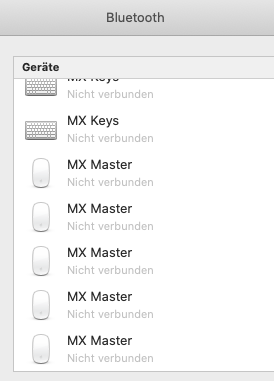
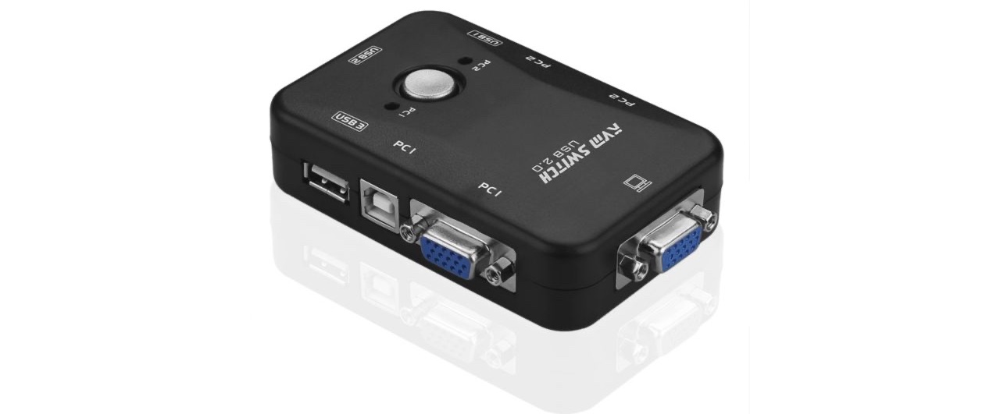

Yesterday a wrote a [post about the MX Keys](https://developapa.com/review/mx-keys) - the keyboard of the MX series.
It only makes sense to talk about the mouse today since they both work pretty well together. 
They are from the same series and have a lot in common. Because of that I will quote a couple of things from the other 
article. 

This is a quick review for my current mouse, the Logitech MX Master 3 
([Product Page](https://www.logitech.com/en-us/product/mx-keys-wireless-keyboard)).  
I put the 3 in brackets in the title since I started with the first generation when they came out and now tested the 
third generation. Even though there are slight differences between the generations, they still share the same advantages 
compared with other products. 

- [Design](#design)
- [Functionality](#functionality)
    - [Scroll Wheel](#scroll-wheel)
    - [Device Switch](#device-switch)
    - [Connectivity](#connectivity)
    - [Logi Options](#logi-options)
    - [Misc](#misc)
- [Drawbacks](#drawbacks)
- [Conclusion](#conclusion)

## Design

The MX Master has a pretty nice shape and perfectly fits your palm. I have big hands and can use the mouse pretty 
comfortably. You can reach all buttons on the side pretty easily.

Even though the designs look similar between the generations, Logitech actually improved the design. Generation 3 feels 
way better and has a  better shape than generation 1 or 2. The scroll wheel on the left side and the two side buttons 
are also better to reach and to use in the latest generation.

## Functionality

### Scroll Wheel
The scroll wheel basically has two modes. You can scroll line by line or spin freely and scroll hundreds of lines. 
There are two ways to enable the free scroll. You can either click on the "Mode Shift Button" on top to toggle the scroll 
mode or you can just spin you wheel faster. If you scroll slowly you scroll line by line but if you give it a little spin 
it'll change modes automatically (and changes back if you stop scrolling).  
Initially I didn't expect it to be useful at all, but now I got used to it and find myself using the spin-free scroll a lot. 

### Device Switch
> Like the Logitech MX Master (Mouse) the MX Keys also has a device switcher and can be connected to up to 3 devices at the 
> same time. This is really handy if you have multiple devices. In my case for example I have a Windows Desktop PC for gaming, 
> a private MacBook Pro for Coding and a MacBook from work. And with just one click I can switch between the devices! No 
> wires, no plugging in connector USB-receiver, nothing.
> 
> This is one of the best features and works pretty nice most of the times (see [Drawbacks](#drawbacks))

The only difference is that the buttons to switch the device are on the bottom of the mouse --> you have to hold it up to 
press. But I think this is totally fine and still prefer this way to have more buttons on top.

### Connectivity
> This keyboard can connect to basically anything. You can use the USB-receiver or can connect via Bluetooth. I connect to the 
> MacBooks via Bluetooth and have the USB-receiver in the Desktop PC.  

### Logi Options
For their newer devices Logitech provides [Logi Options](https://www.logitech.com/en-us/product/options). A small software that 
allows you to do some advanced settings, for example changing the functionality or open apps.

They even have basic gestures support. You can't really do complex gestures, just top / bottom / left / right --> you can assign 
4 gestures per mouse button

Every configuration can be app-specific, so you can have different different button bindings for different apps.

### Misc
* The battery lasts forever, more than 5-6 weeks on daily usage
* Loads via USB-C (Generation 1 loads via Mini-USB), which is pretty convenient if you have a MacBook that already charges via USB-C
* Flow support (meaning it follows the device if the mouse changes device, can copy-past between devices)
* You can connect multiple Logitech devices with one USB-receiver, e.g. I have the MX Keys and MX Master connected with 
just one receiver (saving USB slots and having one receiver more for a different device)

## Drawbacks
I used the mouse for a couple of years and way before the keyboard. But sadly they share the same flaw.
> Sometimes the keyboard lost the Bluetooth connection to my MacBooks. 
> This never happens while I was using the keyboard but rather if I restarted a MacBook or if switched the device on the keyboard.  
> Sometimes it is enough to turn either the keyboard or the MacBook Bluetooth connection off and on again for the keyboard to get 
> the connection. But as you can see on the screenshot sometimes you have to manually re-connect the keyboard.

> I didn't find a pattern yet what causes the loss of the connection. I never had trouble with the connection to the device with USB-receiver.
> So theoretically it could also be a problem caused by macOS.

For a mouse this drawback is actually bigger than for the keyboard. Because (if you are logged in) you can at least re-connect 
the keyboard with just the mouse on macOS, but the other way around this is not possible to do. I work only on MacBooks and 
they have the trackpad anyway. But I can imagine that this might be a problem for iMac users (if you don't want/can use the 
USB-receiver)

## Conclusion
I had the mouse for couple of years now and way longer than the keyboard from this series. It is an awesome mouse.
I like the feeling in my hand, and don't have any trouble using it for 8 hours straight on a working day. It works nice 
on all surfaces and you almost never have to charge it.  
This was the first device I encountered with the possibility to switch devices with just a button and this was a game changer 
for me. I always had multiple computers on my desk. In the past I always used one of those weird device switchers to switch 
the hardware between my computers.

But they always caused cable spaghetti and most of the times I had to use adapters to 
change between different connectors.

For the price of ~80-100€ you get an overall great mouse that can be used for everything. Even though I think Logitech 
planned on marketing this as a business / developer mouse it works just as well as a gaming mouse for me.
