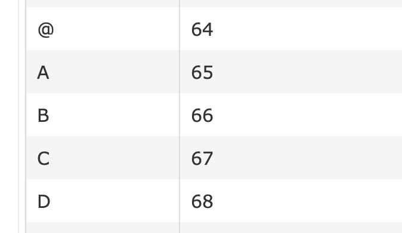

In this quick tutorial I'm going to explain how to build a JavaScript function that can generate Excel column sort values.  
I will build this function recursive, if you have concerns regarding performance, you might want to checkout my
[Conclusion](#conclusion) below.

If you are just here for the code itself and don't bother how it actually works, just go ahead and copy paste it.
(you can also find it in my [Gist](https://gist.github.com/ngehlert/387cb22c66cb1185b0aaaa202da7841e))

```javascript
function numberToLetters(index) {
    const charLimit = 26;
    if (index > charLimit) {
        if (index % charLimit === 0) {
            return '' + numberToLetters(index / charLimit - 1) + numberToLetters(charLimit);
        } else {
            return '' + numberToLetters(Math.trunc(index / charLimit)) + numberToLetters(index % charLimit);
        }
    } else {
        const a = 'A'.charCodeAt(0);

        return String.fromCharCode(a + index - 1);
    }
}
```

If you use TypeScript you can also use this version

```typescript
function numberToLetters(index: number): string {
    const charLimit: number = 26;
    if (index > charLimit) {
        if (index % charLimit === 0) {
            return `${numberToLetters(index / charLimit - 1)}${numberToLetters(charLimit)}`;
        } else {
            return `${numberToLetters(Math.trunc(index / charLimit))}${numberToLetters(index % charLimit)}`;
        }
    } else {
        const a: number = 'A'.charCodeAt(0);

        return String.fromCharCode(a + index - 1);
    }
}
```

- [Implementation](#implementation)
    - [Get a character for number 26 or smaller](#get-a-character-for-number-26-or-smaller)
    - [Numbers greater than 26](#numbers-greater-than-26)
    - [Recursion](#recursion)
- [Conclusion](#conclusion)

## Implementation

### Get a character for number 26 or smaller

Let's start of with how to get the letters from the alphabet. A lot of solutions I saw online use some Array that contains
all 26 letters, but this is actually not needed. JavaScript has a `String.fromCharCode(NUMBER)`
[(mdn documentation)](https://developer.mozilla.org/en-US/docs/Web/JavaScript/Reference/Global_Objects/String/fromCharCode) function that returns the
string value of the UTF-16 character that represents the `NUMBER` value ([What is unicode](https://en.wikipedia.org/wiki/Unicode)).  
There are [tables](https://asecuritysite.com/coding/asc2) with an overview what number represents which value.


For us is just important that there is a sequence in there that contains all letters from A to Z in the right order (from 65 to 91).  
 I'm not a big fan of defining unneeded hard coded limits (in that case start value of 65) and therefore we can get the
starting value with

```javascript
const a = 'A'.charCodeAt(0);
```

`charCodeAt(number)` is the inverse of our previous method. Now we have the variable `a` that holds the starting value of 65.

We want to always get the character at a certain index of the alphabet, e.g.

- param 1 → A
- param 2 → B
- param 26 → Z

```javascript
String.fromCharCode(a + index - 1);
```

We have to subtract 1 from the index since we start counting at 0 because start variable `a` already represents the character A.

So far, so good.

### Numbers greater than 26

Our basic construct will be an if-else to decide whether the value is greater than 26, because in this scenario we have to
split the number and extract how often 26 fits into it and shift the number one position (28 actually has 2 digits, 26
resulting in the first digit A and the rest of 2 results into B → AB).  
If the value is lower than 26 we can get the value at the given index from the step above.
Currently our code looks like this

```javascript
function numberToLetters(index) {
    const charLimit = 26;
    if (index > charLimit) {
    } else {
        const a = 'A'.charCodeAt(0);

        return String.fromCharCode(a + index - 1);
    }
}
```

The next part might actually be a little bit confusing at first. We need to check whether our given number can be divided
by 26 without a rest. Because if there is no rest we are 1 step before 'the jump'.
For example: From 27 on all values start with an A followed up with the letter that represents the rest. 52 is actually the
last number before the jump to the next digit. 52 is AZ while 53 is AAA.  
In JavaScript you can check this with the modulo (`%`) operator

```javascript
> 52 % 26
< 0
> 53 % 26
< 1
```

Added to our code it now looks something like this

```javascript
const charLimit = 26;
if (index > charLimit) {
    if (index % charLimit === 0) {
        // special case if there is no rest
    } else {
        // regular case
    }
} else {
    const a = 'A'.charCodeAt(0);

    return String.fromCharCode(a + index - 1);
}
```

### Recursion

We will build our function recursive.

> In programming terms a recursive function can be defined as a routine that calls itself directly or indirectly
> ([geeksforgeeks.org](https://www.geeksforgeeks.org/recursive-functions/))

In our case this is pretty handy, because we can just split up our number into smaller parts and call our own function with
each part and then simply combine the result.

Let's start with our regular case first.

If our number is greater than 26, we will always split the number up into at least two numbers.
One represents how often 26 fits into our given number and the other one the rest.  
With `Math.trunc(index / charLimit)` we get the first one (`Math.trunc` removes all potential decimal values).  
`Math.trunc(value / 26)`:

- value = 52 → 2
- value = 53 → 2
- value = 78 → 3
- value = 79 → 3

Like mentionend earlier with this number we now want to call our function `numberToLetters` itself to get the letter for our first digit.

We already learned that with modulo we can get the rest (`index % charLimit`). Same principle applies for this case - a call to
`numberToLetters` will give us our second digit.

Put together our regular case looks like this

```javascript
return '' + numberToLetters(Math.trunc(index / charLimit)) + numberToLetters(index % charLimit);
```

Before we go on to our last special case, let's check our previous lines in theory with 2 examples.  
`numberToLetters(76)`:  
76 split up is: 2 \* 26 + 24.  
Calling `numberToLetters(2)` results in a B and `numberToLetters(24)` in a X. Our result is **BX**

`numberToLetters(1991)`:
1991 split up is: 76 \* 26 + 15.  
Well, now we face the problem that our first number itself is actually bigger than 26, so we have to split it up again.
In this case we already know from our previous example that `numberToLetters(76)` is BX and `numberToLetters(15)` is O.  
`numberToLetters(1991)` results in a total of **BXO**

With everything we learned so far our special case can be implemented like this

```javascript
return '' + numberToLetters(index / charLimit - 1) + numberToLetters(charLimit);
```

We basically manually _jump one digit_ back. `52 / 26` results in 2 and would return us `B`. But actually we need an `A`.
So we just subtract 1 from it. Since we now there are no leftovers (from our previous modulo check `index % charLimit === 0`)
the last value is just the last possible letter of the alphabet → `Z`.  
With that in place `numberToLetters(52)` correctly returns **AZ**.

If we put everything together we get our fully working function

```javascript
function numberToLetters(index) {
    const charLimit = 26;
    if (index > charLimit) {
        if (index % charLimit === 0) {
            return '' + numberToLetters(index / charLimit - 1) + numberToLetters(charLimit);
        } else {
            return '' + numberToLetters(Math.trunc(index / charLimit)) + numberToLetters(index % charLimit);
        }
    } else {
        const a = 'A'.charCodeAt(0);

        return String.fromCharCode(a + index - 1);
    }
}
```

## Conclusion

This should just be a little guide and can be an easy example on how to explain and learn recursion.
I know that due to the recursion this is not the fastest solution out there, but unless you are generating all sort
values up until like 1.000.000 and beyond you are totally fine.  
Here is a little test script `time-test.js`

```javascript
const LIMIT = 1000000;
console.time('performanceTest');
const sortValues = [];
for (let i = 0; i < LIMIT; i++) {
    sortValues.push(numberToLetters(i));
}
console.timeEnd('performanceTest');
console.log(sortValues.length);
```

And calling `$ node time-test.js` resulted in `performanceTest: 256.638ms` (the '.' in this case is the decimal separator).
So generating the first one million sort values only takes 250ms.
But if you test higher limits, e.g. 10mio (takes ~5-6 seconds), you quickly see that recursive functions don't
scale linear ;)  
In my case I needed values up until 1.000 and that takes not even a millisecond, and I think this is totally fine.
