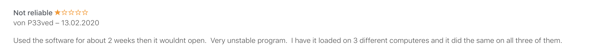

#### Click [here](https://apps.apple.com/us/app/made-my-day/id1481700999?l=de&ls=1&mt=12) to get it from the App Store

If you don't know _Made my day_ yet, head over to [my first Blog Post](/made-my-day) for more information.

_Made my day_ is now 10 months out, I did multiple updates, added new features and learned a lot of things - especially
non code related stuff. In this post I want to share some of my experiences.

- [Dealing with negative feedback](#dealing-with-negative-feedback)
- [Provide better communication channel](#provide-better-communication-channel)
- [Concept](#concept)
- [Conclusion](#conclusion)

## Dealing with negative feedback

Dealing with feedback and criticism is actually a really important skill to have and helps you improve. But this was more
or less the first time I had to deal with _negative_ feedback online. And while I think that usually I can handle feedback pretty
well, dealing with online feedback was difficult for me and took some time to get used to.
It's a different kind of feedback if you can't see the other person talking in real life and have no direct way to
answer.

Let's look at the first example, which is actually an review in the app store

> Used the software for about 2 weeks then it wouldnt open. Very unstable program. I have it loaded on 3 different
> computeres and it did the same on all three of them.

Not gonna lie, this one was tough to digest. My initial reaction was very defensive and I though to myself, "well then
just don't use it. You probably are doing it wrong anyway". I talked a lot with a good friend of mine and he helped me actually
understand what the user is _really_ saying.  
(Most) People are not mean, angry or bully persons! Someone saw the description in the AppStore and though "hey this sounds
nice. I'm willing to pay couple of bucks to use this software". He actually **wanted** to use _Made my day_.
Of course he is going to be disappointed when it does not work like he expected, I would be as well if I were in the same situation.

In this case the challenge was that I was not able to reproduce the error on any device with any macOS version. Till
this day I have no idea if this is still happening, if I fixed it with an update, if this was a problem with my software in
the first place, or if there are even other problems I don't know yet.  
The second thing that makes AppStore reviews challenging is that there is no way for me to contact said person. I replied
with a comment, but there is no notification system on Apple side to notify you when someone answered to your review. And
let's face it, who opens reviews written couple of weeks / months ago, just to check if somebody replied? Right, nobody…

## Provide better communication channel

This directly leads me to my second point. I didn't provide an easy way of contacting me if there are any problems. Sure I have
this blog (which some people actually used as a method to contact me) and AppStore reviews. A handful of people got really
fancy and looked up my e-mail in the AppStore description and directly wrote me an e-mail.  
The key to a good user communication is probably speed. I didn't know that there was no notification if someone leaves a comment
in the AppStore, so it took me more than a week to actually respond.  
_(For comments in this blog I technically have a notification system but there was a bug resulting in notifications not being
send, so there was also a delay in the meantime)_  
Another point in this category, provide a way to attach some debug information for me to work with. We all know those
bugsplat screens with "Send report to XXX" - I understand now their purpose.  
I would've given everything just for a little bit of information on the error, but I have nothing.
Just those few lines from the review.

This raises a couple of questions:

- "Why didn't I do those things?"
- "Why is there no direct support possibility built into the app?"
- "Why is there no bugsplat error tracker?"

A lot of this stuff is actually not easy to do in the Apple AppStore world due to permission restrictions (which
are actually a nice feature, not complaining here) so I thought my app would not fail and expected it to work
**everywhere & all the time**.  
And secondly I do this in my spare time and just for fun. Sometimes I leave stuff out or give it low priority when it
is not fun to implement or I think there is no _real benefit_.

Takeaways for future projects:

- Provide clear communication channel
- Respond fast, in the best case have a way to directly reply to the user
- Attach as much error output as possible
- Accept that your app WILL fail and prepare for it

## Concept

Let's have a look at another review

> versprochener Export ist nirgends zu finden

Which roughly translates that the user couldn't find the export functionality. The core idea of this entire app was to have
an independent and widely used file format, so you still have access to all your data even if you don't like the app
anymore. **There is no need to export any data - it is just raw markdown**.  
If this message is not being understood, maybe I didn't make a good job at explaining and advertising this core principle.

## Conclusion

In this post I talked a lot about the negative feedback I received. But I also got a lot of positive feedback and support
which I really appreciate. Every single e-mail, comment, review, etc.! Thank you!  
Nevertheless, I'm thankful even for those negative reviews as they helped me grow as a person and developer. And they
tell me that my idea is actually good and there is a _demand_ for my app, but maybe my app just hasn't lived up to all
the expectations for every user.  
My goal is still to make every user like _Made my day_ the same way I do. And sometimes the road to goals has stones and barriers
along the way 😉

I'm still planning to add more features to _Made my day_, but it probably will take some time. If you have any ideas feel free
to contact me.
