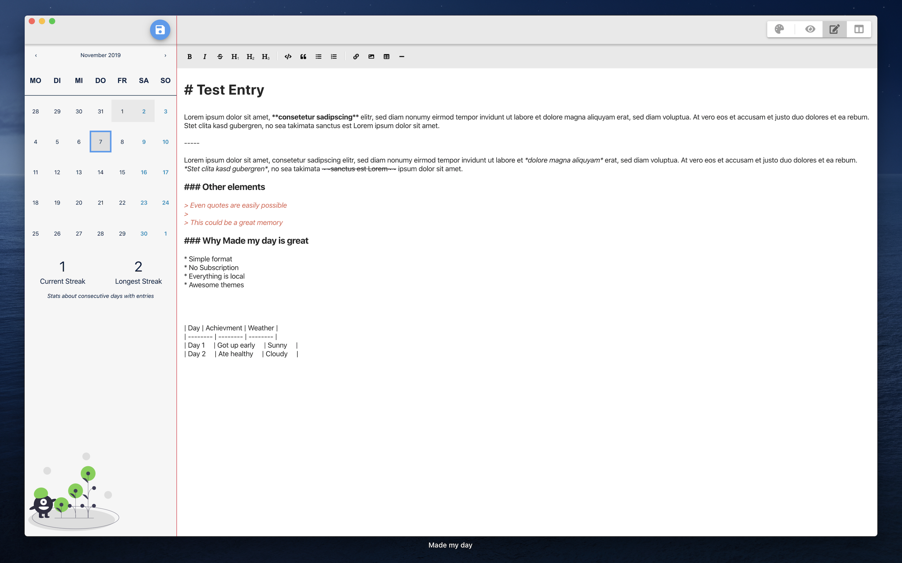

#### Click [here](https://apps.apple.com/us/app/made-my-day/id1481700999?l=de&ls=1&mt=12) to get it from the App Store

With this blog post I want to present my latest app for macOS - a minimalistic journaling app.  
You might ask if another journaling app ist really necessary so I try to quickly explain the benefits of _Made my day_
and differences to other common apps.

- [No subscription](#no-subscription)
- [Standard format](#standard-format)
- [Full file control](#full-file-control)
- [Themes](#themes)
- [GDPR](#gdpr)
- [Future plans](#future-plans)

## No subscription

Most of the apps I already tested in the past year require some sort of monthly/yearly subscription to get all features
and fully use the app. _Made my day_ is and will always be without a subscription.

## Standard format

There is nothing worse than a proprietary file format and no (or complicated) way to export your data in case you ever
want to switch apps.  
I decided to use Markdown because it is pretty widely known and it is really easy to convert to other formats like HTML
or Word.

## Full file control

Personal journal entries are very sensitive files. Because of that I think it just make sense to give full control to the
end user. Don't rely on custom cloud solutions - everything is just stored locally on your system in a directory that you
specify.

- Want to save everything on your iCloud? Just select a directory in your _Documents_ / _Desktop_ directory (depending on
  your cloud settings)
- Google Drive? Dropbox? ... ? Everything is possible
- Even saving everything on an USB drive so no data is on your PC is really easy
- And for the developers out there you can also use private repository 😉

## Themes

Added in the first big update. Check [the update Blog post](/made-my-day-2) for detailed information. There are a couple
beautiful themes available. If your favorite theme is not available, leave a comment and I try to add it in a future update.

## GDPR

There are no external resources that get loaded. No HTTP requests are made. No user registration. **Everything runs
locally**.  
tl;dr: No personal user data is collected or saved

## Future plans

I'm not quite done with _Made my day_ but I decided it is time for it to get user feedback and suggestions. Most core
functionality is implemented.  
Things I have in mind for future updates:

- ~~Different themes~~ (already added, [Update notes](/made-my-day-2))
- ~~Image support~~ (also added with previous update)
- ~~Different languages~~ (added with a second update in March 2020, [Update preview](/monthly-update-feb-20/#made-my-day))
- ~~Search~~ (added with an update beginning 2022, [Update notes](/made-my-day-4))

If you have any ideas of cool features or feedback just leave a comment.
