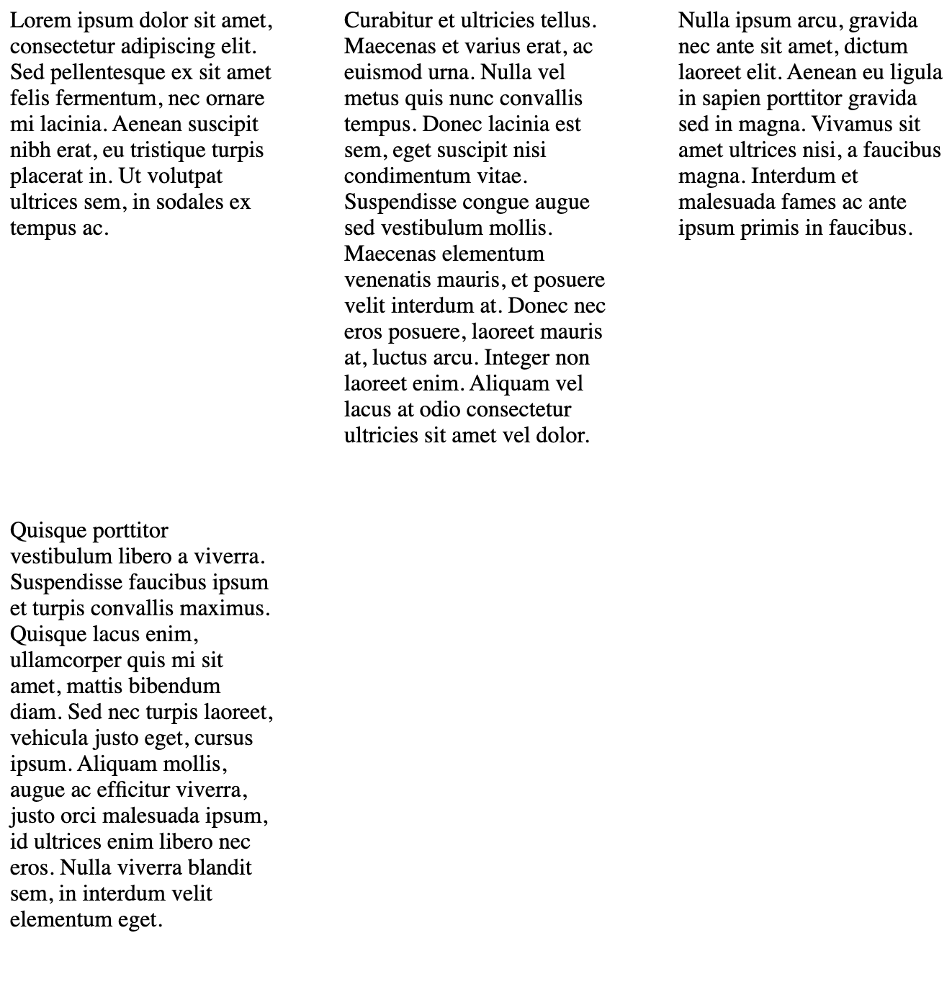
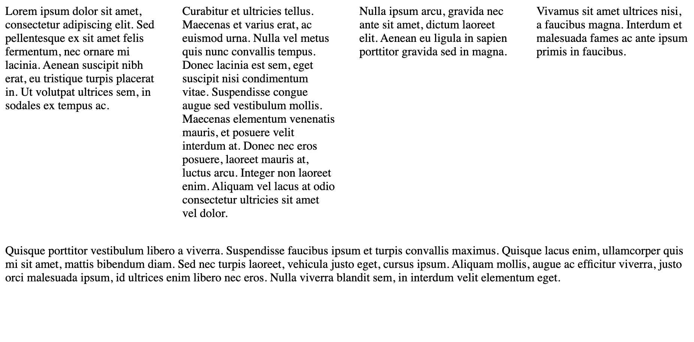

In this short tutorial I want to demonstrate three different ways how to achieve a **fully responsive column layout** with
only CSS and no JavaScript. And by _fully responsive_ I mean a layout that is responsive without the necessity to specify
media queries for specific breakpoints.
We will touch a `flex` version, a `grid` version and a less familiar `columns` property of CSS.

- [Columns](#columns)
    - [Prevent content breaking](#prevent-content-breaking)
    - [Limitations](#column-limitations)
- [Grid](#grid)
    - [Limitations](#grid-limitations)
- [Flex](#flex)
    - [Limitations](#flex-limitations)
- [Conclusion](#conclusion)

## Columns

Let's start with this one, because it probably is the most interesting and at the same time least known version.
The CSS `columns` property is responsive by design. It is a shorthand for `column-count` and `column-width`.  
`column-count` allows you to define the number of columns that should be visible. `column-width` defines a minimum width each
column needs to have. The browser will evenly distribute the available width into columns of at least this min width, and if
there is room for another column it will automatically create that one.  
When using the `columns` shorthand (or declaring both properties), `column-width` acts as a min width per column but `column-count`
acts as a maximum amount of columns that will be rendered. For example `columns: 3 200px;` will create a layout with three columns
at most, but each column will always be at least 200px wide.

Example: ([See on stackblitz](https://stackblitz.com/edit/js-zzuvmn?file=style.css))

```css
.columns {
    columns: 3 200px;
    column-gap: 3em;
    column-rule: 1px solid #cecece;
}
```

Additional properties

- `column-gap`: Defines the space between the columns
- `column-rule`: Defines a border that is visible between the columns

### Prevent content breaking

Sometimes you want to display content that should not break between columns, for example if you want to put cards into columns for a dashboard.
For this scenario there is the `break-inside` CSS property. And with `break-inside: avoid` you prevent single elements from being
split up into different columns. (You can find an example for this in the [Previous example on stackblitz](https://stackblitz.com/edit/js-zzuvmn?file=style.css))

### Column Limitations

There are a couple of additional properties that are not yet supported in all browsers, for example `column-span` to break the column flow
temporarily (e.g. for content/chapter headings) or `column-fill` to define whether the content should fill all available height or
evenly distribute (only if a height for the entire column is set).  
If a height is specified the content will overflow horizontally if content exceeds space limits, which may be ok depending on the
situation but sometimes may not. Can be tackled with a media query based on the height or an outer vertical scroll container.

## Grid

Now let's have a look at the grid version. The first difference is in the required setup. You actually need each column to be
in a separate HTML Element, so having a big `<p>` tag and trying to split it up into multiple columns is not going to work
with CSS grid.  
I assume you are familiar with the basics of CSS grid.  
The `grid-template-columns` property supports an `repeat` function with two parameters. The first parameter is the amount of
times the element should be repeated, the second property defines the width of each element.  
With the `minmax` function we can define a column width with a min- and max-width and using the `1fr` unit for the max value will
make this layout responsive. Using the `auto-fit` property for the amount of times parameter, will create as many columns as
needed to fit the content inside the columns.

Example: ([See on stackblitz](https://stackblitz.com/edit/js-xa31ny?file=style.css))

```css
.columns {
    display: grid;
    grid-template-columns: repeat(auto-fit, minmax(150px, 1fr));
    grid-gap: 3em;
}
```

Additional properties

- `grid-gap`: Defines the space between the columns **and rows**
- As far as I know there is no similar thing compared to `column-rule`, so if something similar is needed you need to set a border on the child elements (and don't show one on `:last-child`)
- `auto-fit` and `auto-fill`: Both of them are valid options for the `repeat` function and in a lot of cases you might not even notice a difference. However, there is a small difference. `auto-fit` will always scale all available elements to fill the browser width. `auto-fill` will not scale the elements. So if you have room for 6 elements the browser will render 6 white spaces, but if you only have 4 elements worth of content the last two columns will be empty. Go ahead in the stackblitz example and try change the property and then change the window width.

### Grid Limitations

If you have more elements than columns (because the browser width is smaller than all the min-widths of the elements combined),
the elements have to be put into multiple rows. Since all elements inside a row share the same height,
there might be unwanted white space between the items.


_Example image to demonstrate white space between first and fourth paragraph_

## Flex

For a long time `flex` has been the _I-use-this-for-everything_ property because it was the _fresh new stuff_. Let's check if we
can create a similar layout with `flex` as well.  
With the `flex-basis` property (third parameter in the `flex` shorthand) we can set a min-width for our elements. With a zero
value for the `flex-shrink` property (second parameter in the `flex` shorthand) we prevent the elements from shrinking below our
desired min-width.

Example: ([See on stackblitz](https://stackblitz.com/edit/js-yndo9g?file=style.css))

```css
.columns {
    display: flex;
    flex-wrap: wrap;
    gap: 2em;
}

.card {
    flex: 1 0 200px;
}
```

Additional properties

- `gap`: Defines the space between the columns **and rows**. Alias for `grid-gap` and is according to MDN docs also supposed to be used for flex containers ([MDN Docs](https://developer.mozilla.org/en-US/docs/Web/CSS/gap))
- As far as I know there is no similar thing compared to `column-rule`, so if something similar is needed you need to set a border on the child elements (and don't show one on `:last-child`)

### Flex Limitations

By the nature of flex, it will always scale to the full available width. If the first row only has space for 4 elements, the fifth
element will be put in the second row but stretched to the entire width.


_Example image to demonstrate flex row breaking issues_

As far as I know there is no workaround to prevent this kind of behaviour (since this is supposed how flex should work) that does not
involve media queries.

## Conclusion

If you are expecting a final **Use _this_ approach** answer, I have to disappoint you. Ultimately it comes down to your specific
requirements. Secondly, I know that some drawbacks can be patched with the proper media queries - but I was looking for a solution
that does not involve any. Why use one option with media queries or other workarounds, if another option does the same job just as well but without
the extra effort.

Let's look at our last example with flex, if your design does not allow for different widths in the last row this approach might not be the best solution.
However, with [CSS Media Queries](https://developer.mozilla.org/en-US/docs/Web/CSS/CSS_Container_Queries) on the horizon, this might
actually be a neat and certainly will bring freshness (that would not be possible with `grid`) to the layout if
you can style the elements based on container width.

If you have a fixed amount of elements that you want to evenly distribute into columns (and rows) and want a _grid look_ - elements in the rows should have the same height - then
option two is probably the way to go. Also grid has a lot of advanced features like sub-grid which can be used to align stuff in different columns on the same vertical level.

If you want to split up a paragraph into multiple columns I definitely would recommend option one. It's also a good choice for cases where you
don't want white space between multiple elements inside the same columns, so it does not _look/feel like a grid_ - for example for a
pinterest-like layout.

So far I mostly used `grid` simply because I'm the most familiar with it, but I definitely will try to use `columns` more often in the
future (and try to build designs that allow me to do that). I love the simplicity of it.

Let me know what kind of experiences you've made with either of those (or maybe even completely separate) approaches.
