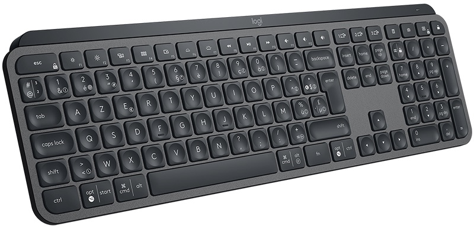
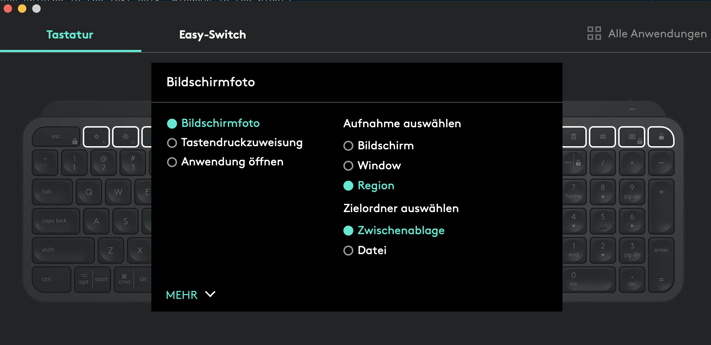
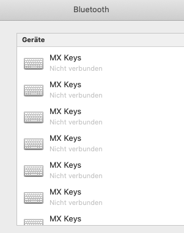

This is a quick review for my current keyboard, the Logitech MX Keys
([Product Page](https://www.logitech.com/en-us/product/mx-keys-wireless-keyboard))

- [Design](#design)
- [Functionality](#functionality)
    - [Device Switch](#device-switch)
    - [Connectivity](#connectivity)
    - [Logi Options](#logi-options)
    - [Misc](#misc)
- [Drawbacks](#drawbacks)
- [Conclusion](#conclusion)

## Design

The design is really nice - it is slim & clean and has no unneeded gimmicks. The keys are pretty flat and
from a pressure point and click feeling (and typing sound) remind me of the MacBook Pro keyboard (pre 2016 and new Butterfly).

- react really fast and with little pressure
- nice haptic feedback
- silent
- good grasp to every key, no accidental multi-key-clicks

Initially I was really skeptical when I saw those "spherically dished keys" but turns out you don't really _feel_ them
while typing and instead it just has a much more natural feeling for your fingertips when you type.

The keyboard can be used for both Windows and macOS system, and has both layouts printed on the keys (macOS functionality
is always printed in the left half, Windows in the right)

## Functionality

### Device Switch

Like the Logitech MX Master (Mouse) the MX Keys also has a device switcher and can be connected to up to 3 devices at the
same time. This is really handy if you have multiple devices. In my case for example I have a Windows Desktop PC for gaming,
a private MacBook Pro for Coding and a MacBook from work. And with just one click I can switch between the devices! No
wires, no plugging in connector USB-receiver, nothing.

This is one of the best features and works pretty nice most of the times (see [Drawbacks](#drawbacks))

### Connectivity

This keyboard can connect to basically anything. You can use the USB-receiver or can connect via Bluetooth. I connect to the
MacBooks via Bluetooth and have the USB-receiver in the Desktop PC.  
I tested connecting to a Linux PC and it worked with the USB-receiver. I even tried connecting to a Raspberry Pi, but
for some reason this only worked as long as I kept the Pi on channel 1. If I used some other device on channel 1 it wouldn't work
anymore. Even removing said device afterwords didn't help. So if you want to use it with a Pi, just don't change anything.

I haven't tried connecting it to an iPad or iPhone yet.

### Logi Options

For their never devices Logitech provides [Logi Options](https://www.logitech.com/en-us/product/options). A small software that
allows you to do some advanced settings, for example special keybindings for the F-Keys or the special keys above numpad.
You can choose between the default option per key (and sometimes with advanced options, see screenshot), a key combo or opening
an app.

Those settings are specific per device, so you can have different settings for every Device (but if you connect two
different MX Keys to the same device, they will have the same settings 😉 ). And you can save those settings online in
your Logitech Account.

### Misc

- The battery lasts forever. Don't really pay attention when I load it but it lasts for at least 3-4 weeks with heave daily usage
- Loads via USB-C, which is pretty convenient if you have a MacBook that already charges via USB-C
- There are proximity sensors for the backlight, so the backlight only is active if your hands are on the keyboard
- Backlighting automatically adapts to lighting conditions, but can also be set manually
- Flow support if you have a mouse that supports it (meaning it follows the device if the mouse changes device, can copy-past
  between devices)
- You can connect multiple Logitech devices with one USB-receiver, e.g. I have the MX Keys and MX Master connected with
  just one receiver (saving USB slots and having one receiver more for a different device)
- If you don't want to use the multimedia keys in the top row, you can toggle the regular function-key functionality with a
  simple shortcut (Fn + esc)

## Drawbacks

I used it for 5 months now and only discovered one flaw. Sometimes the keyboard lost the Bluetooth connection to my
MacBooks. This never happens while I was using the keyboard but rather if I restarted a MacBook or if switched the device
on the keyboard.  
Sometimes it is enough to turn either the keyboard or the MacBook Bluetooth connection off and on again for the keyboard to get
the connection. But as you can see on the screenshot sometimes you have to manually re-connect the keyboard.

Even though the connecting process is really fast and it takes only like 30 seconds (and the settings are saved anyway)
this is still annoying.  
I didn't find a pattern yet what causes the loss of the connection. I never had trouble with the connection to the device with USB-receiver.
So theoretically it could also be a problem caused by macOS. However if you want to use this keyboard for an iMac I recommend
connecting with the USB-receiver (otherwise you have to plug in a different keyboard if you lost connection while you were signed out)

## Conclusion

To put it short - This is the best keyboard I ever owned! It is really really nice for coding and my work life. Great key
feeling, quick response times and a nice design.  
I even let it replace my Logitech G510 keyboard I used previously for gaming.  
The device switching is just the cherry on top and is awesome if you have multiple devices but just want to have one keyboard
for everything.
