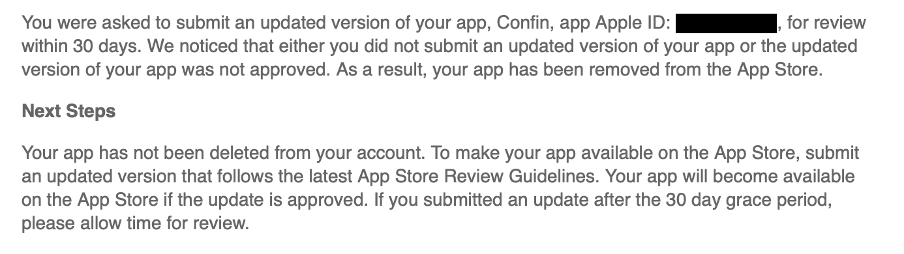

## What happened?

Apple has removed [Confin](https://developapa.com/confin) from the App Store. For everyone still using Confin this has **no impact**.  
You still can use the App as expected and the servers will continue to run. However, you will not be able to download it anymore on any
other device.

## Why?

Apparently Apple is doing an "summer clean up" because there was a big wave and a lot of people got a Mail like this couple of months ago.

> You received this message as part of our ongoing App Store Improvement process, which identifies apps that may no longer function as intended,
> don’t follow current review guidelines, or are outdated

While I understand the intention behind it, to remove old and maybe unused Apps that might not even work anymore from the App Store this still
feels very weird and drastic. Confin works perfectly fine with all iOS versions, still has couple of active users and some downloads from
time to time.

Following a public backlash Apple at least increased the window to re-submit an update for your App from 30 to 90 days.

## My problems and plans for the future

Confin is my little baby. It is one of my first real world Applications that hit the App Stores. I started developing it only for me
when I got into programming in the first place. Over the years there were multiple re-writes, a lot of new ideas and endless hours spend
to try new things and technologies (Maybe I should write a separate Post about how it has evolved over the last 10 years).

But in the last ~2 years I focused on other projects because Confin worked fine for me and covered my current needs. Because of that
it is not easy for me to "just publish a new version to the App Store".  
The tech stack/some libraries became outdated or are not supported anymore.
I would need to invest a lot of time to just get the same version that is currently available re-submitted to the App Store.

Confin started out during a time, where very few banking/finance Apps actually existed. I didn't investigate what's out there currently, but probably
there's an App that is just doing the same thing.  
For now I will leave it be for a couple of days/weeks and see how I want to move forward from there.

**Thanks for everyone using Confin over the years! Thanks for all the feedback and support! <3**
