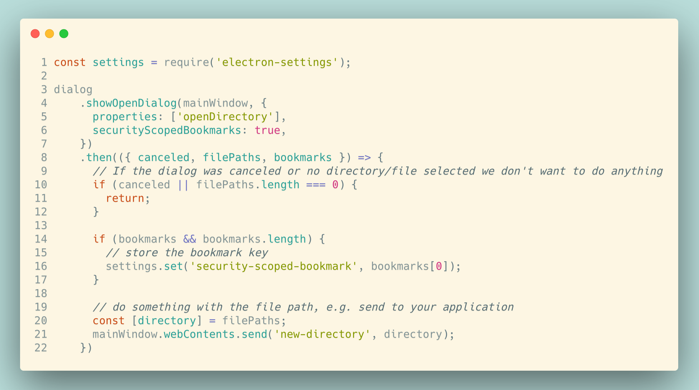
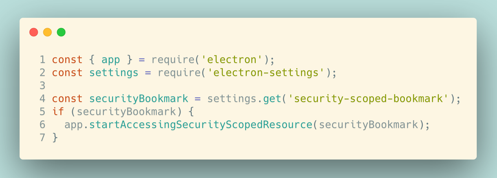
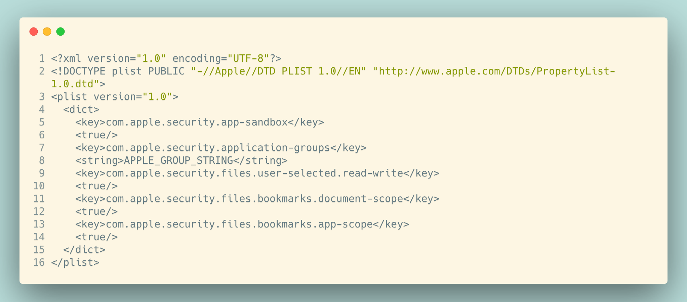

As you might know macOS is pretty strict with its permission management and what apps are allowed to do on your system.
This totally benefits us as users, because it is difficult for malicious apps to have access to parts of your Mac outside
of the app environment. In this blog post I shortly want to explain what Security Scoped Bookmarks are and why you might need
them

- [What are Security Scoped Bookmarks (SSBs) ](#what-are-security-scoped-bookmarks-ssbs)
- [How to work with SSBs in Electron](#how-to-work-with-ssbs-in-electron)
- [Conclusion](#conclusion)

## What are Security Scoped Bookmarks (SSBs)

Sometimes your app actually needs access to system resources. Let's take my app
[Made my day](https://developapa.com/made-my-day) as an example. You select a directory with the regular system dialog
and want to save your journal entries to that directory.  
This works totally fine. Now imagine if we close the app, reopen it and programmatically select the same directory
to read/save files. You'd think this would work but it actually **does not**. You get a 'permission denied' error.

So what is going on here? The open directory dialog basically just grants you a _one time access permission_. One
workaround (that was actually suggested to me during the AppStore Verification Process) could
be to force the user to always use the open directory dialog. But in my eyes this is a pretty bad user experience.
There **has** to be a better way.

That's were SSBs join the party. Let's have a quick look at apples definition

> Starting in macOS 10.7.3, you can retain access to file-system resources by employing a security mechanism, known as security-scoped bookmarks, that preserves user intent.
> (_[Apple developer documentation](https://developer.apple.com/library/archive/documentation/Security/Conceptual/AppSandboxDesignGuide/AppSandboxInDepth/AppSandboxInDepth.html#//apple_ref/doc/uid/TP40011183-CH3-SW16)_)

To put into simple words, **if a user grants you access to a specific directory/file, you can _preserve the user intent_ and
access the same directory/file in the future as well.** (With that SSB)

## How to work with SSBs in Electron

**This entire section is only needed if you want to publish your app in the AppStore!**

Since Electron 6.0.0 the `dialog.showOpenDialog()` ([Documentation](https://electronjs.org/docs/api/dialog#dialogshowopendialogbrowserwindow-options))
returns a promise that resolves to the `filePaths` and `bookmarks` (SSBs).
If we put everything together it could look something like this:

_View code in [Gist](https://gist.github.com/ngehlert/74d5a26990811eed59c635e49134d669)_

And on the app module from electron there is a method called `startAccessingSecurityScopedResource(bookmarkData)`
([Documentation](https://electronjs.org/docs/api/app#appstartaccessingsecurityscopedresourcebookmarkdata-mas))
that accepts one of those SSBs.

_View code in [Gist](https://gist.github.com/ngehlert/74d5a26990811eed59c635e49134d669)_

Don't forget to set proper entitlements for your packaged app in your `parent.plist`

_View code in [Gist](https://gist.github.com/ngehlert/b841c33a2aabb4cfa28e3bd9bafd828a)_

#### Conclusion

With this SSB you can now reopen the same directory on your next app launch.
My example is with a directory, but the same concept applies when used in combination with a file.  
Let me know what you think of the concept of SSBs or some of your use cases.
